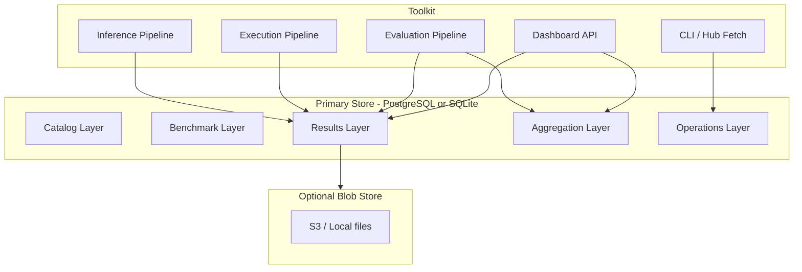

```mermaid
flowchart TB
    subgraph toolkit [Toolkit]
        INF[Inference Pipeline]
        EXE[Execution Pipeline]
        EVA[Evaluation Pipeline]
        DASH[Dashboard API]
        CLI[CLI / Hub Fetch]
    end

    subgraph db [Primary Store - PostgreSQL or SQLite]
        CAT[Catalog Layer]
        BENCH[Benchmark Layer]
        RES[Results Layer]
        AGG[Aggregation Layer]
        OPS[Operations Layer]
    end

    subgraph blobs [Optional Blob Store]
        S3[S3 / Local files]
    end

    INF --> RES
    EXE --> RES
    EVA --> RES
    EVA --> AGG
    DASH --> AGG
    DASH --> RES
    CLI --> OPS
    RES --> blobs
```