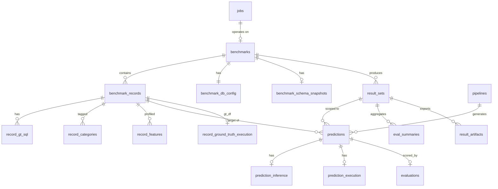

```mermaid

erDiagram
    benchmarks ||--o{ benchmark_records : contains
    benchmarks ||--|| benchmark_db_config : has
    benchmarks ||--o| benchmark_schema_snapshots : has
    benchmark_records ||--o{ record_gt_sql : has
    benchmark_records ||--o{ record_categories : tagged
    benchmark_records ||--o{ record_features : profiled

    benchmarks ||--o{ result_sets : produces
    pipelines ||--o{ predictions : generates
    result_sets ||--o{ predictions : "scoped to"
    benchmark_records ||--o{ predictions : "target of"

    predictions ||--o| prediction_inference : has
    predictions ||--o| prediction_execution : has
    predictions ||--o| evaluations : scored_by
    benchmark_records ||--o| record_ground_truth_execution : gt_df

    result_sets ||--o{ eval_summaries : aggregates
    result_sets ||--o{ result_artifacts : exports

    jobs ||--o| benchmarks : "operates on"
```
