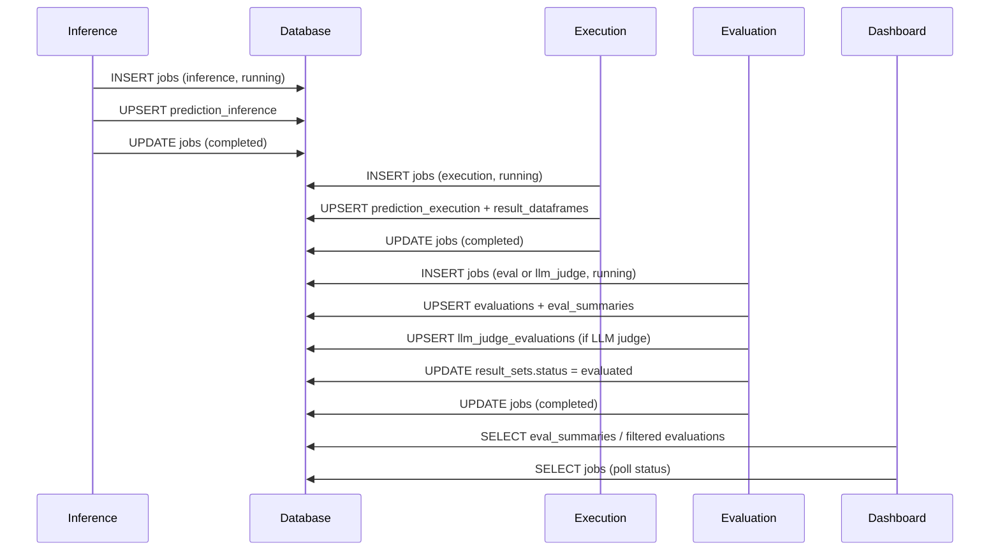

```mermaid
sequenceDiagram
    participant INF as Inference
    participant DB as Database
    participant EXE as Execution
    participant EVA as Evaluation
    participant DASH as Dashboard

    INF->>DB: INSERT jobs (inference, running)
    INF->>DB: UPSERT prediction_inference
    INF->>DB: UPDATE jobs (completed)
    EXE->>DB: INSERT jobs (execution, running)
    EXE->>DB: UPSERT prediction_execution + result_dataframes
    EXE->>DB: UPDATE jobs (completed)
    EVA->>DB: INSERT jobs (eval or llm_judge, running)
    EVA->>DB: UPSERT evaluations + eval_summaries
    EVA->>DB: UPSERT llm_judge_evaluations (if LLM judge)
    EVA->>DB: UPDATE result_sets.status = evaluated
    EVA->>DB: UPDATE jobs (completed)
    DASH->>DB: SELECT eval_summaries / filtered evaluations
    DASH->>DB: SELECT jobs (poll status)
```
