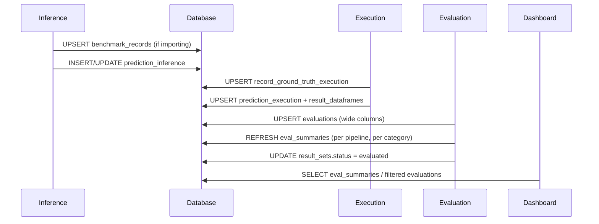

```mermaid
sequenceDiagram
    participant INF as Inference
    participant DB as Database
    participant EXE as Execution
    participant EVA as Evaluation
    participant DASH as Dashboard

    INF->>DB: UPSERT benchmark_records (if importing)
    INF->>DB: INSERT/UPDATE prediction_inference
    EXE->>DB: UPSERT record_ground_truth_execution
    EXE->>DB: UPSERT prediction_execution + result_dataframes
    EVA->>DB: UPSERT evaluations (wide columns)
    EVA->>DB: REFRESH eval_summaries (per pipeline, per category)
    EVA->>DB: UPDATE result_sets.status = evaluated
    DASH->>DB: SELECT eval_summaries / filtered evaluations
```
