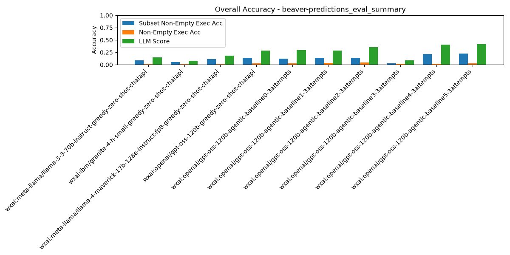

# Summary Results

## Overall Average Accuracy Results

| Rank | Pipeline | Records # | Predictions # | Exec Acc | Non-Empty Exec Acc | Subset Non-Empty Exec Acc | BIRD Exec Acc | Parsable SQL | Syntactic Equivalence Score | LLM Score |
| --- | --- | --- | --- | --- | --- | --- | --- | --- | --- | --- |
| 1 | wxai:openai/gpt-oss-120b-agentic-baseline5-3attempts | 209 | 0 | 0.03 | 0.03 | 0.23 | 0.03 | 1.00 | 0.00 | 0.42 |
| 2 | wxai:openai/gpt-oss-120b-agentic-baseline4-3attempts | 209 | 0 | 0.02 | 0.02 | 0.21 | 0.03 | 1.00 | 0.00 | 0.41 |
| 3 | wxai:openai/gpt-oss-120b-agentic-baseline1-3attempts | 209 | 0 | 0.04 | 0.03 | 0.14 | 0.06 | 0.99 | 0.00 | 0.29 |
| 4 | wxai:openai/gpt-oss-120b-greedy-zero-shot-chatapi | 209 | 0 | 0.03 | 0.03 | 0.14 | 0.06 | 0.98 | 0.00 | 0.29 |
| 5 | wxai:openai/gpt-oss-120b-agentic-baseline2-3attempts | 209 | 0 | 0.05 | 0.04 | 0.14 | 0.07 | 0.98 | 0.00 | 0.35 |
| 6 | wxai:openai/gpt-oss-120b-agentic-baseline0-3attempts | 209 | 0 | 0.03 | 0.03 | 0.12 | 0.06 | 1.00 | 0.00 | 0.30 |
| 7 | wxai:meta-llama/llama-4-maverick-17b-128e-instruct-fp8-greedy-zero-shot-chatapi | 209 | 0 | 0.02 | 0.01 | 0.11 | 0.04 | 1.00 | 0.00 | 0.18 |
| 8 | wxai:meta-llama/llama-3-3-70b-instruct-greedy-zero-shot-chatapi | 209 | 0 | 0.02 | 0.01 | 0.09 | 0.05 | 1.00 | 0.00 | 0.15 |
| 9 | wxai:ibm/granite-4-h-small-greedy-zero-shot-chatapi | 209 | 0 | 0.01 | 0.01 | 0.05 | 0.02 | 1.00 | 0.00 | 0.08 |
| 10 | wxai:openai/gpt-oss-120b-agentic-baseline3-3attempts | 209 | 0 | 0.02 | 0.02 | 0.03 | 0.03 | 0.96 | 0.00 | 0.09 |

