# Summary Results

## Overall Average Accuracy Results

| Rank | Pipeline | Records # | Predictions # | Exec Acc | Non-Empty Exec Acc | Subset Non-Empty Exec Acc | BIRD Exec Acc | Parsable SQL | Syntactic Equivalence Score | LLM Score |
| --- | --- | --- | --- | --- | --- | --- | --- | --- | --- | --- |
| 1 | wxai:openai/gpt-oss-120b-greedy-zero-shot-chatapi | 500 | 0 | 0.51 | 0.51 | 0.57 | 0.53 | 1.00 | 0.04 | 0.79 |
| 2 | wxai:meta-llama/llama-4-maverick-17b-128e-instruct-fp8-greedy-zero-shot-chatapi | 500 | 0 | 0.53 | 0.53 | 0.56 | 0.56 | 1.00 | 0.12 | 0.73 |
| 3 | wxai:meta-llama/llama-3-3-70b-instruct-greedy-zero-shot-chatapi | 500 | 0 | 0.51 | 0.51 | 0.54 | 0.55 | 1.00 | 0.08 | 0.71 |
| 4 | wxai:openai/gpt-oss-120b-agentic-baseline1-3attempts | 500 | 0 | 0.40 | 0.40 | 0.44 | 0.42 | 1.00 | 0.04 | 0.68 |
| 5 | wxai:openai/gpt-oss-120b-agentic-baseline2-3attempts | 500 | 0 | 0.39 | 0.39 | 0.44 | 0.41 | 1.00 | 0.04 | 0.68 |
| 6 | wxai:ibm/granite-4-h-small-greedy-zero-shot-chatapi | 500 | 0 | 0.41 | 0.41 | 0.44 | 0.43 | 1.00 | 0.04 | 0.56 |
| 7 | wxai:openai/gpt-oss-120b-agentic-baseline4-3attempts | 500 | 0 | 0.36 | 0.36 | 0.43 | 0.38 | 1.00 | 0.02 | 0.66 |
| 8 | wxai:openai/gpt-oss-120b-agentic-baseline0-3attempts | 500 | 0 | 0.32 | 0.32 | 0.42 | 0.35 | 1.00 | 0.03 | 0.72 |
| 9 | wxai:openai/gpt-oss-120b-agentic-baseline5-3attempts | 500 | 0 | 0.32 | 0.32 | 0.34 | 0.34 | 1.00 | 0.03 | 0.49 |
| 10 | wxai:openai/gpt-oss-120b-agentic-baseline3-3attempts | 500 | 0 | 0.02 | 0.02 | 0.03 | 0.02 | 0.99 | 0.03 | 0.07 |

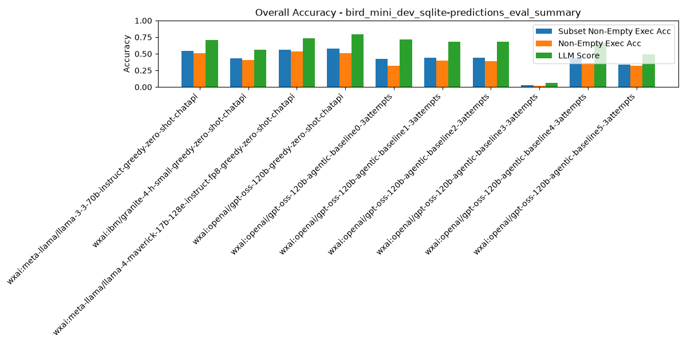

## Category: `difficulty_challenging`

| Rank | Pipeline | Records # | Predictions # | Exec Acc | Non-Empty Exec Acc | Subset Non-Empty Exec Acc | BIRD Exec Acc | Parsable SQL | Syntactic Equivalence Score | LLM Score |
| --- | --- | --- | --- | --- | --- | --- | --- | --- | --- | --- |
| 1 | wxai:openai/gpt-oss-120b-greedy-zero-shot-chatapi | 102 | 0 | 0.41 | 0.41 | 0.47 | 0.43 | 1.00 | 0.00 | 0.77 |
| 2 | wxai:meta-llama/llama-4-maverick-17b-128e-instruct-fp8-greedy-zero-shot-chatapi | 102 | 0 | 0.43 | 0.43 | 0.46 | 0.47 | 1.00 | 0.01 | 0.70 |
| 3 | wxai:meta-llama/llama-3-3-70b-instruct-greedy-zero-shot-chatapi | 102 | 0 | 0.36 | 0.36 | 0.40 | 0.41 | 1.00 | 0.00 | 0.60 |
| 4 | wxai:openai/gpt-oss-120b-agentic-baseline2-3attempts | 102 | 0 | 0.27 | 0.27 | 0.35 | 0.30 | 1.00 | 0.00 | 0.65 |
| 5 | wxai:openai/gpt-oss-120b-agentic-baseline4-3attempts | 102 | 0 | 0.24 | 0.24 | 0.31 | 0.26 | 1.00 | 0.00 | 0.59 |
| 6 | wxai:openai/gpt-oss-120b-agentic-baseline1-3attempts | 102 | 0 | 0.26 | 0.26 | 0.31 | 0.27 | 1.00 | 0.00 | 0.64 |
| 7 | wxai:ibm/granite-4-h-small-greedy-zero-shot-chatapi | 102 | 0 | 0.23 | 0.23 | 0.28 | 0.25 | 1.00 | 0.00 | 0.40 |
| 8 | wxai:openai/gpt-oss-120b-agentic-baseline0-3attempts | 102 | 0 | 0.16 | 0.16 | 0.26 | 0.20 | 0.99 | 0.00 | 0.69 |
| 9 | wxai:openai/gpt-oss-120b-agentic-baseline5-3attempts | 102 | 0 | 0.13 | 0.13 | 0.14 | 0.15 | 1.00 | 0.00 | 0.32 |
| 10 | wxai:openai/gpt-oss-120b-agentic-baseline3-3attempts | 102 | 0 | 0.05 | 0.05 | 0.06 | 0.05 | 0.99 | 0.00 | 0.11 |

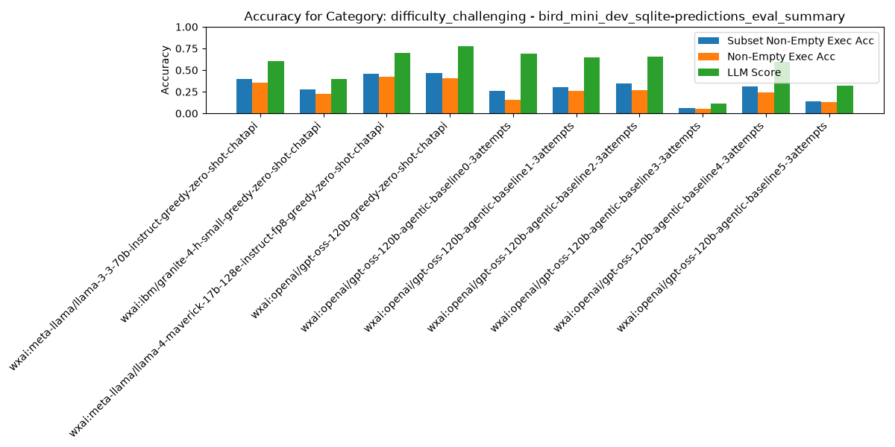

## Category: `difficulty_moderate`

| Rank | Pipeline | Records # | Predictions # | Exec Acc | Non-Empty Exec Acc | Subset Non-Empty Exec Acc | BIRD Exec Acc | Parsable SQL | Syntactic Equivalence Score | LLM Score |
| --- | --- | --- | --- | --- | --- | --- | --- | --- | --- | --- |
| 1 | wxai:meta-llama/llama-3-3-70b-instruct-greedy-zero-shot-chatapi | 250 | 0 | 0.51 | 0.51 | 0.55 | 0.54 | 1.00 | 0.03 | 0.69 |
| 2 | wxai:meta-llama/llama-4-maverick-17b-128e-instruct-fp8-greedy-zero-shot-chatapi | 250 | 0 | 0.51 | 0.51 | 0.55 | 0.53 | 1.00 | 0.08 | 0.71 |
| 3 | wxai:openai/gpt-oss-120b-greedy-zero-shot-chatapi | 250 | 0 | 0.49 | 0.49 | 0.54 | 0.51 | 1.00 | 0.01 | 0.77 |
| 4 | wxai:ibm/granite-4-h-small-greedy-zero-shot-chatapi | 250 | 0 | 0.39 | 0.39 | 0.42 | 0.41 | 1.00 | 0.01 | 0.55 |
| 5 | wxai:openai/gpt-oss-120b-agentic-baseline1-3attempts | 250 | 0 | 0.37 | 0.37 | 0.42 | 0.40 | 1.00 | 0.00 | 0.64 |
| 6 | wxai:openai/gpt-oss-120b-agentic-baseline4-3attempts | 250 | 0 | 0.33 | 0.33 | 0.40 | 0.36 | 1.00 | 0.00 | 0.65 |
| 7 | wxai:openai/gpt-oss-120b-agentic-baseline2-3attempts | 250 | 0 | 0.35 | 0.35 | 0.40 | 0.38 | 1.00 | 0.00 | 0.64 |
| 8 | wxai:openai/gpt-oss-120b-agentic-baseline0-3attempts | 250 | 0 | 0.30 | 0.30 | 0.39 | 0.33 | 1.00 | 0.00 | 0.69 |
| 9 | wxai:openai/gpt-oss-120b-agentic-baseline5-3attempts | 250 | 0 | 0.24 | 0.24 | 0.26 | 0.25 | 1.00 | 0.00 | 0.42 |
| 10 | wxai:openai/gpt-oss-120b-agentic-baseline3-3attempts | 250 | 0 | 0.02 | 0.02 | 0.02 | 0.02 | 0.99 | 0.00 | 0.07 |

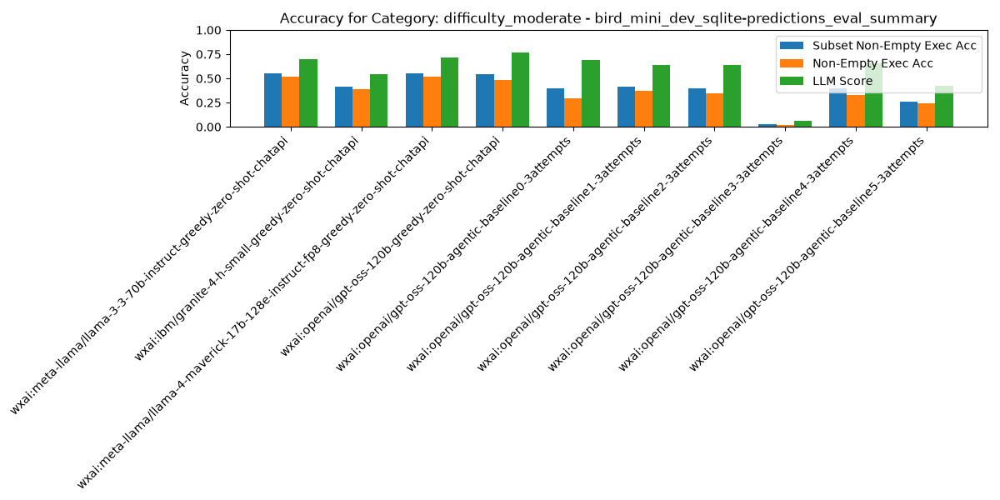

## Category: `difficulty_simple`

| Rank | Pipeline | Records # | Predictions # | Exec Acc | Non-Empty Exec Acc | Subset Non-Empty Exec Acc | BIRD Exec Acc | Parsable SQL | Syntactic Equivalence Score | LLM Score |
| --- | --- | --- | --- | --- | --- | --- | --- | --- | --- | --- |
| 1 | wxai:openai/gpt-oss-120b-greedy-zero-shot-chatapi | 148 | 0 | 0.63 | 0.63 | 0.70 | 0.65 | 1.00 | 0.13 | 0.84 |
| 2 | wxai:meta-llama/llama-4-maverick-17b-128e-instruct-fp8-greedy-zero-shot-chatapi | 148 | 0 | 0.64 | 0.64 | 0.66 | 0.67 | 1.00 | 0.26 | 0.79 |
| 3 | wxai:meta-llama/llama-3-3-70b-instruct-greedy-zero-shot-chatapi | 148 | 0 | 0.59 | 0.59 | 0.63 | 0.66 | 1.00 | 0.23 | 0.79 |
| 4 | wxai:openai/gpt-oss-120b-agentic-baseline1-3attempts | 148 | 0 | 0.53 | 0.53 | 0.58 | 0.57 | 1.00 | 0.12 | 0.76 |
| 5 | wxai:openai/gpt-oss-120b-agentic-baseline2-3attempts | 148 | 0 | 0.53 | 0.53 | 0.58 | 0.55 | 1.00 | 0.12 | 0.78 |
| 6 | wxai:ibm/granite-4-h-small-greedy-zero-shot-chatapi | 148 | 0 | 0.56 | 0.56 | 0.57 | 0.58 | 1.00 | 0.13 | 0.70 |
| 7 | wxai:openai/gpt-oss-120b-agentic-baseline0-3attempts | 148 | 0 | 0.46 | 0.46 | 0.57 | 0.49 | 1.00 | 0.09 | 0.78 |
| 8 | wxai:openai/gpt-oss-120b-agentic-baseline4-3attempts | 148 | 0 | 0.49 | 0.49 | 0.55 | 0.49 | 1.00 | 0.07 | 0.72 |
| 9 | wxai:openai/gpt-oss-120b-agentic-baseline5-3attempts | 148 | 0 | 0.53 | 0.53 | 0.55 | 0.56 | 1.00 | 0.07 | 0.68 |
| 10 | wxai:openai/gpt-oss-120b-agentic-baseline3-3attempts | 148 | 0 | 0.00 | 0.00 | 0.02 | 0.00 | 0.99 | 0.10 | 0.03 |

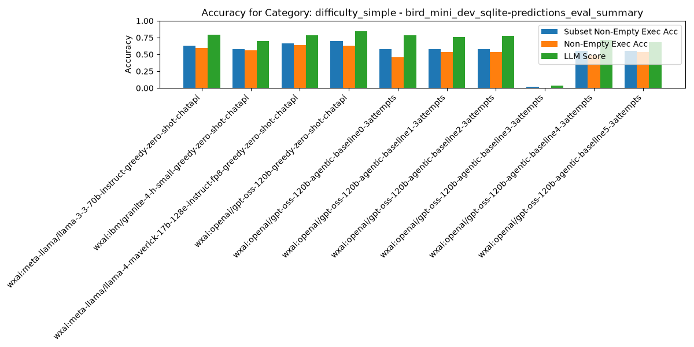

## Category: `has_aggregation`

| Rank | Pipeline | Records # | Predictions # | Exec Acc | Non-Empty Exec Acc | Subset Non-Empty Exec Acc | BIRD Exec Acc | Parsable SQL | Syntactic Equivalence Score | LLM Score |
| --- | --- | --- | --- | --- | --- | --- | --- | --- | --- | --- |
| 1 | wxai:meta-llama/llama-4-maverick-17b-128e-instruct-fp8-greedy-zero-shot-chatapi | 246 | 0 | 0.55 | 0.55 | 0.56 | 0.55 | 1.00 | 0.05 | 0.73 |
| 2 | wxai:openai/gpt-oss-120b-greedy-zero-shot-chatapi | 246 | 0 | 0.51 | 0.51 | 0.55 | 0.52 | 1.00 | 0.02 | 0.80 |
| 3 | wxai:meta-llama/llama-3-3-70b-instruct-greedy-zero-shot-chatapi | 246 | 0 | 0.52 | 0.52 | 0.53 | 0.52 | 1.00 | 0.03 | 0.70 |
| 4 | wxai:ibm/granite-4-h-small-greedy-zero-shot-chatapi | 246 | 0 | 0.41 | 0.41 | 0.43 | 0.41 | 1.00 | 0.02 | 0.56 |
| 5 | wxai:openai/gpt-oss-120b-agentic-baseline1-3attempts | 246 | 0 | 0.37 | 0.37 | 0.39 | 0.37 | 1.00 | 0.02 | 0.66 |
| 6 | wxai:openai/gpt-oss-120b-agentic-baseline2-3attempts | 246 | 0 | 0.36 | 0.36 | 0.39 | 0.36 | 1.00 | 0.02 | 0.66 |
| 7 | wxai:openai/gpt-oss-120b-agentic-baseline0-3attempts | 246 | 0 | 0.29 | 0.29 | 0.38 | 0.29 | 1.00 | 0.01 | 0.72 |
| 8 | wxai:openai/gpt-oss-120b-agentic-baseline4-3attempts | 246 | 0 | 0.32 | 0.32 | 0.38 | 0.32 | 1.00 | 0.00 | 0.61 |
| 9 | wxai:openai/gpt-oss-120b-agentic-baseline5-3attempts | 246 | 0 | 0.29 | 0.29 | 0.30 | 0.29 | 1.00 | 0.00 | 0.47 |
| 10 | wxai:openai/gpt-oss-120b-agentic-baseline3-3attempts | 246 | 0 | 0.02 | 0.02 | 0.02 | 0.02 | 1.00 | 0.01 | 0.06 |

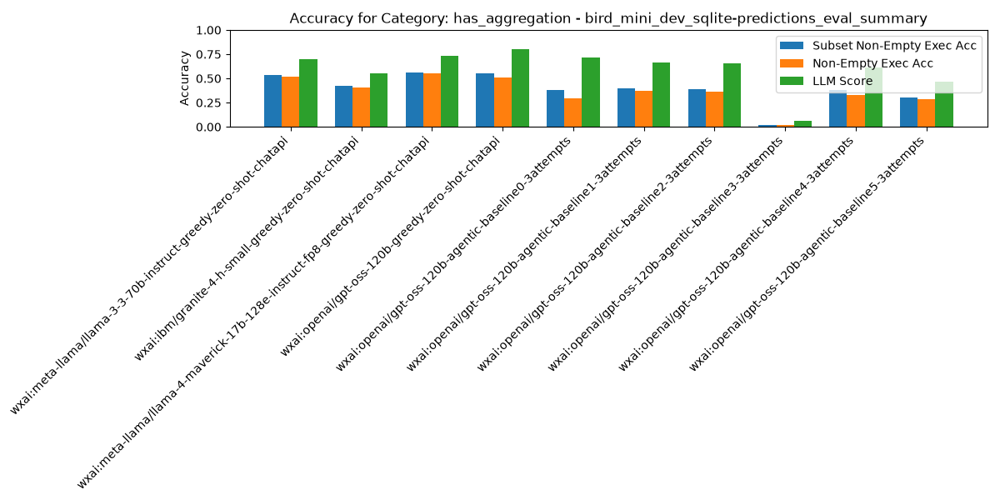

## Category: `has_join`

| Rank | Pipeline | Records # | Predictions # | Exec Acc | Non-Empty Exec Acc | Subset Non-Empty Exec Acc | BIRD Exec Acc | Parsable SQL | Syntactic Equivalence Score | LLM Score |
| --- | --- | --- | --- | --- | --- | --- | --- | --- | --- | --- |
| 1 | wxai:openai/gpt-oss-120b-greedy-zero-shot-chatapi | 407 | 0 | 0.49 | 0.49 | 0.54 | 0.51 | 1.00 | 0.00 | 0.78 |
| 2 | wxai:meta-llama/llama-4-maverick-17b-128e-instruct-fp8-greedy-zero-shot-chatapi | 407 | 0 | 0.51 | 0.51 | 0.54 | 0.54 | 1.00 | 0.09 | 0.72 |
| 3 | wxai:meta-llama/llama-3-3-70b-instruct-greedy-zero-shot-chatapi | 407 | 0 | 0.48 | 0.48 | 0.52 | 0.52 | 1.00 | 0.05 | 0.69 |
| 4 | wxai:openai/gpt-oss-120b-agentic-baseline2-3attempts | 407 | 0 | 0.38 | 0.38 | 0.42 | 0.40 | 1.00 | 0.00 | 0.66 |
| 5 | wxai:openai/gpt-oss-120b-agentic-baseline1-3attempts | 407 | 0 | 0.38 | 0.38 | 0.42 | 0.40 | 1.00 | 0.00 | 0.67 |
| 6 | wxai:openai/gpt-oss-120b-agentic-baseline4-3attempts | 407 | 0 | 0.35 | 0.35 | 0.41 | 0.36 | 1.00 | 0.00 | 0.66 |
| 7 | wxai:openai/gpt-oss-120b-agentic-baseline0-3attempts | 407 | 0 | 0.30 | 0.30 | 0.39 | 0.33 | 1.00 | 0.00 | 0.71 |
| 8 | wxai:ibm/granite-4-h-small-greedy-zero-shot-chatapi | 407 | 0 | 0.36 | 0.36 | 0.39 | 0.37 | 1.00 | 0.00 | 0.52 |
| 9 | wxai:openai/gpt-oss-120b-agentic-baseline5-3attempts | 407 | 0 | 0.28 | 0.28 | 0.29 | 0.30 | 1.00 | 0.00 | 0.45 |
| 10 | wxai:openai/gpt-oss-120b-agentic-baseline3-3attempts | 407 | 0 | 0.02 | 0.02 | 0.03 | 0.02 | 0.99 | 0.00 | 0.07 |

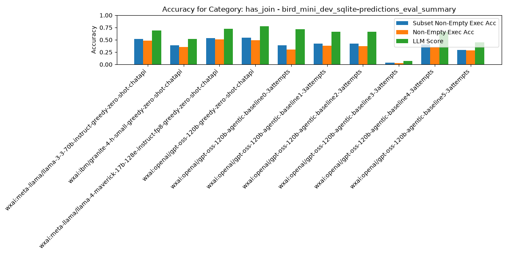

## Category: `has_nested_query`

| Rank | Pipeline | Records # | Predictions # | Exec Acc | Non-Empty Exec Acc | Subset Non-Empty Exec Acc | BIRD Exec Acc | Parsable SQL | Syntactic Equivalence Score | LLM Score |
| --- | --- | --- | --- | --- | --- | --- | --- | --- | --- | --- |
| 1 | wxai:meta-llama/llama-3-3-70b-instruct-greedy-zero-shot-chatapi | 64 | 0 | 0.45 | 0.45 | 0.50 | 0.50 | 1.00 | 0.00 | 0.69 |
| 2 | wxai:meta-llama/llama-4-maverick-17b-128e-instruct-fp8-greedy-zero-shot-chatapi | 64 | 0 | 0.45 | 0.45 | 0.48 | 0.50 | 1.00 | 0.00 | 0.71 |
| 3 | wxai:openai/gpt-oss-120b-greedy-zero-shot-chatapi | 64 | 0 | 0.35 | 0.35 | 0.45 | 0.42 | 1.00 | 0.00 | 0.79 |
| 4 | wxai:openai/gpt-oss-120b-agentic-baseline1-3attempts | 64 | 0 | 0.34 | 0.34 | 0.40 | 0.35 | 1.00 | 0.00 | 0.71 |
| 5 | wxai:openai/gpt-oss-120b-agentic-baseline2-3attempts | 64 | 0 | 0.31 | 0.31 | 0.40 | 0.34 | 1.00 | 0.00 | 0.66 |
| 6 | wxai:openai/gpt-oss-120b-agentic-baseline4-3attempts | 64 | 0 | 0.29 | 0.29 | 0.39 | 0.32 | 1.00 | 0.00 | 0.70 |
| 7 | wxai:openai/gpt-oss-120b-agentic-baseline0-3attempts | 64 | 0 | 0.26 | 0.26 | 0.35 | 0.32 | 0.98 | 0.00 | 0.77 |
| 8 | wxai:ibm/granite-4-h-small-greedy-zero-shot-chatapi | 64 | 0 | 0.31 | 0.31 | 0.34 | 0.34 | 1.00 | 0.02 | 0.49 |
| 9 | wxai:openai/gpt-oss-120b-agentic-baseline5-3attempts | 64 | 0 | 0.29 | 0.29 | 0.31 | 0.35 | 1.00 | 0.00 | 0.47 |
| 10 | wxai:openai/gpt-oss-120b-agentic-baseline3-3attempts | 64 | 0 | 0.02 | 0.02 | 0.02 | 0.02 | 0.97 | 0.00 | 0.06 |

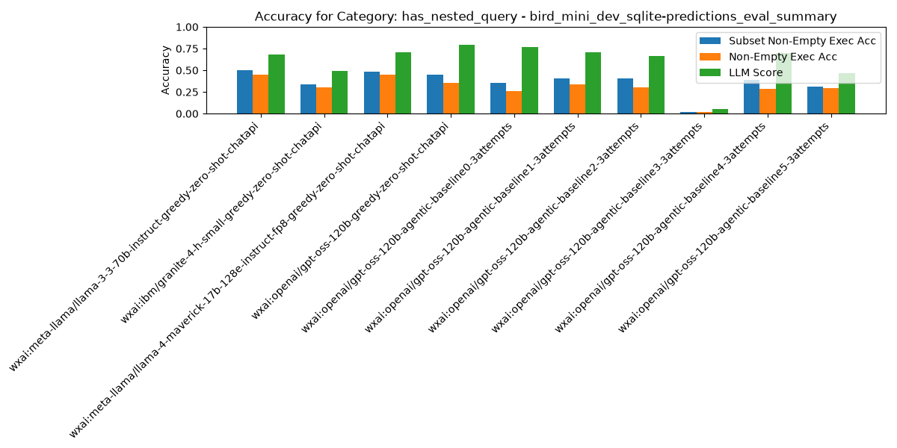

## Category: `has_sorting`

| Rank | Pipeline | Records # | Predictions # | Exec Acc | Non-Empty Exec Acc | Subset Non-Empty Exec Acc | BIRD Exec Acc | Parsable SQL | Syntactic Equivalence Score | LLM Score |
| --- | --- | --- | --- | --- | --- | --- | --- | --- | --- | --- |
| 1 | wxai:meta-llama/llama-4-maverick-17b-128e-instruct-fp8-greedy-zero-shot-chatapi | 105 | 0 | 0.55 | 0.55 | 0.62 | 0.54 | 1.00 | 0.09 | 0.73 |
| 2 | wxai:meta-llama/llama-3-3-70b-instruct-greedy-zero-shot-chatapi | 105 | 0 | 0.51 | 0.51 | 0.60 | 0.51 | 1.00 | 0.06 | 0.70 |
| 3 | wxai:openai/gpt-oss-120b-greedy-zero-shot-chatapi | 105 | 0 | 0.43 | 0.43 | 0.59 | 0.44 | 1.00 | 0.03 | 0.82 |
| 4 | wxai:openai/gpt-oss-120b-agentic-baseline1-3attempts | 105 | 0 | 0.37 | 0.37 | 0.50 | 0.37 | 1.00 | 0.01 | 0.68 |
| 5 | wxai:openai/gpt-oss-120b-agentic-baseline2-3attempts | 105 | 0 | 0.39 | 0.39 | 0.50 | 0.39 | 1.00 | 0.02 | 0.70 |
| 6 | wxai:openai/gpt-oss-120b-agentic-baseline4-3attempts | 105 | 0 | 0.30 | 0.30 | 0.49 | 0.29 | 1.00 | 0.00 | 0.72 |
| 7 | wxai:ibm/granite-4-h-small-greedy-zero-shot-chatapi | 105 | 0 | 0.43 | 0.43 | 0.48 | 0.44 | 1.00 | 0.03 | 0.58 |
| 8 | wxai:openai/gpt-oss-120b-agentic-baseline0-3attempts | 105 | 0 | 0.24 | 0.24 | 0.46 | 0.25 | 0.99 | 0.00 | 0.77 |
| 9 | wxai:openai/gpt-oss-120b-agentic-baseline5-3attempts | 105 | 0 | 0.34 | 0.34 | 0.37 | 0.34 | 1.00 | 0.01 | 0.48 |
| 10 | wxai:openai/gpt-oss-120b-agentic-baseline3-3attempts | 105 | 0 | 0.01 | 0.01 | 0.03 | 0.01 | 0.98 | 0.02 | 0.08 |

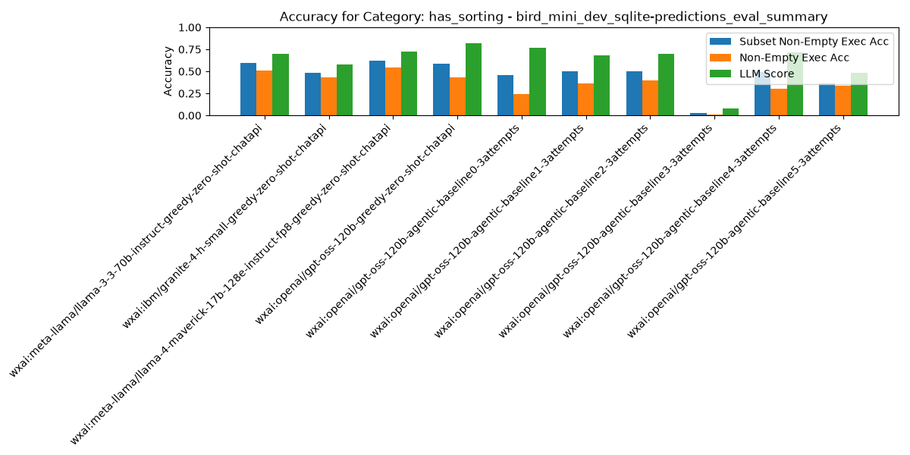

## Category: `has_window_function`

| Rank | Pipeline | Records # | Predictions # | Exec Acc | Non-Empty Exec Acc | Subset Non-Empty Exec Acc | BIRD Exec Acc | Parsable SQL | Syntactic Equivalence Score | LLM Score |
| --- | --- | --- | --- | --- | --- | --- | --- | --- | --- | --- |
| 1 | wxai:meta-llama/llama-3-3-70b-instruct-greedy-zero-shot-chatapi | 5 | 0 | 0.20 | 0.20 | 0.80 | 0.20 | 1.00 | 0.00 | 1.00 |
| 2 | wxai:ibm/granite-4-h-small-greedy-zero-shot-chatapi | 5 | 0 | 0.20 | 0.20 | 0.60 | 0.20 | 1.00 | 0.00 | 0.60 |
| 3 | wxai:meta-llama/llama-4-maverick-17b-128e-instruct-fp8-greedy-zero-shot-chatapi | 5 | 0 | 0.20 | 0.20 | 0.60 | 0.20 | 1.00 | 0.00 | 0.60 |
| 4 | wxai:openai/gpt-oss-120b-agentic-baseline4-3attempts | 5 | 0 | 0.50 | 0.50 | 0.50 | 0.50 | 1.00 | 0.00 | 0.50 |
| 5 | wxai:openai/gpt-oss-120b-agentic-baseline1-3attempts | 5 | 0 | 0.40 | 0.40 | 0.40 | 0.40 | 1.00 | 0.00 | 0.60 |
| 6 | wxai:openai/gpt-oss-120b-agentic-baseline2-3attempts | 5 | 0 | 0.40 | 0.40 | 0.40 | 0.40 | 1.00 | 0.00 | 0.40 |
| 7 | wxai:openai/gpt-oss-120b-agentic-baseline5-3attempts | 5 | 0 | 0.25 | 0.25 | 0.25 | 0.25 | 1.00 | 0.00 | 0.50 |
| 8 | wxai:openai/gpt-oss-120b-greedy-zero-shot-chatapi | 5 | 0 | 0.20 | 0.20 | 0.20 | 0.40 | 1.00 | 0.00 | 0.80 |
| 9 | wxai:openai/gpt-oss-120b-agentic-baseline0-3attempts | 5 | 0 | 0.20 | 0.20 | 0.20 | 0.20 | 1.00 | 0.00 | 0.40 |
| 10 | wxai:openai/gpt-oss-120b-agentic-baseline3-3attempts | 5 | 0 | 0.00 | 0.00 | 0.00 | 0.00 | 0.80 | 0.00 | 0.00 |

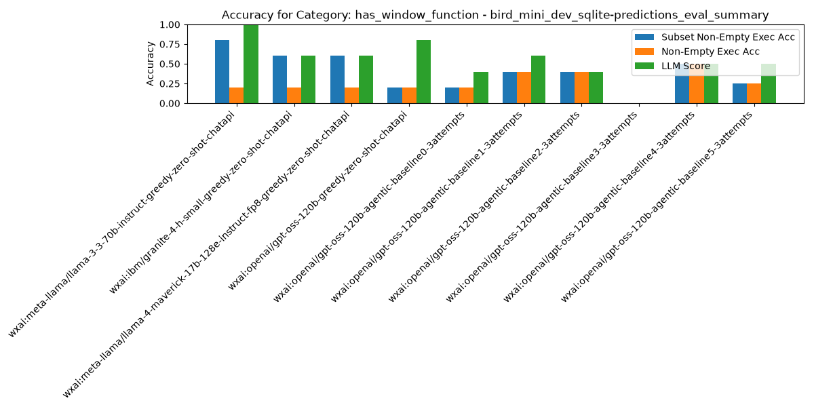

## Category: `multi_table_simple`

| Rank | Pipeline | Records # | Predictions # | Exec Acc | Non-Empty Exec Acc | Subset Non-Empty Exec Acc | BIRD Exec Acc | Parsable SQL | Syntactic Equivalence Score | LLM Score |
| --- | --- | --- | --- | --- | --- | --- | --- | --- | --- | --- |
| 1 | wxai:openai/gpt-oss-120b-greedy-zero-shot-chatapi | 357 | 0 | 0.51 | 0.51 | 0.57 | 0.52 | 1.00 | 0.00 | 0.78 |
| 2 | wxai:meta-llama/llama-4-maverick-17b-128e-instruct-fp8-greedy-zero-shot-chatapi | 357 | 0 | 0.52 | 0.52 | 0.55 | 0.55 | 1.00 | 0.10 | 0.73 |
| 3 | wxai:meta-llama/llama-3-3-70b-instruct-greedy-zero-shot-chatapi | 357 | 0 | 0.49 | 0.49 | 0.53 | 0.53 | 1.00 | 0.05 | 0.69 |
| 4 | wxai:openai/gpt-oss-120b-agentic-baseline2-3attempts | 357 | 0 | 0.39 | 0.39 | 0.44 | 0.41 | 1.00 | 0.00 | 0.67 |
| 5 | wxai:openai/gpt-oss-120b-agentic-baseline1-3attempts | 357 | 0 | 0.39 | 0.39 | 0.43 | 0.41 | 1.00 | 0.00 | 0.66 |
| 6 | wxai:openai/gpt-oss-120b-agentic-baseline4-3attempts | 357 | 0 | 0.36 | 0.36 | 0.42 | 0.37 | 1.00 | 0.00 | 0.66 |
| 7 | wxai:openai/gpt-oss-120b-agentic-baseline0-3attempts | 357 | 0 | 0.31 | 0.31 | 0.41 | 0.34 | 1.00 | 0.00 | 0.71 |
| 8 | wxai:ibm/granite-4-h-small-greedy-zero-shot-chatapi | 357 | 0 | 0.37 | 0.37 | 0.40 | 0.38 | 1.00 | 0.00 | 0.53 |
| 9 | wxai:openai/gpt-oss-120b-agentic-baseline5-3attempts | 357 | 0 | 0.30 | 0.30 | 0.31 | 0.30 | 1.00 | 0.00 | 0.46 |
| 10 | wxai:openai/gpt-oss-120b-agentic-baseline3-3attempts | 357 | 0 | 0.03 | 0.03 | 0.04 | 0.03 | 0.99 | 0.00 | 0.08 |

## Category: `single_source_advanced`

| Rank | Pipeline | Records # | Predictions # | Exec Acc | Non-Empty Exec Acc | Subset Non-Empty Exec Acc | BIRD Exec Acc | Parsable SQL | Syntactic Equivalence Score | LLM Score |
| --- | --- | --- | --- | --- | --- | --- | --- | --- | --- | --- |
| 1 | wxai:openai/gpt-oss-120b-greedy-zero-shot-chatapi | 5 | 0 | 0.60 | 0.60 | 1.00 | 0.60 | 1.00 | 0.00 | 1.00 |
| 2 | wxai:openai/gpt-oss-120b-agentic-baseline0-3attempts | 5 | 0 | 0.60 | 0.60 | 1.00 | 0.60 | 1.00 | 0.00 | 1.00 |
| 3 | wxai:openai/gpt-oss-120b-agentic-baseline1-3attempts | 5 | 0 | 0.60 | 0.60 | 1.00 | 0.60 | 1.00 | 0.00 | 1.00 |
| 4 | wxai:openai/gpt-oss-120b-agentic-baseline2-3attempts | 5 | 0 | 0.60 | 0.60 | 1.00 | 0.60 | 1.00 | 0.00 | 1.00 |
| 5 | wxai:meta-llama/llama-3-3-70b-instruct-greedy-zero-shot-chatapi | 5 | 0 | 0.60 | 0.60 | 0.80 | 0.60 | 1.00 | 0.00 | 0.80 |
| 6 | wxai:ibm/granite-4-h-small-greedy-zero-shot-chatapi | 5 | 0 | 0.60 | 0.60 | 0.80 | 0.60 | 1.00 | 0.00 | 0.80 |
| 7 | wxai:meta-llama/llama-4-maverick-17b-128e-instruct-fp8-greedy-zero-shot-chatapi | 5 | 0 | 0.60 | 0.60 | 0.80 | 0.60 | 1.00 | 0.00 | 0.80 |
| 8 | wxai:openai/gpt-oss-120b-agentic-baseline4-3attempts | 5 | 0 | 0.40 | 0.40 | 0.80 | 0.40 | 1.00 | 0.00 | 0.80 |
| 9 | wxai:openai/gpt-oss-120b-agentic-baseline5-3attempts | 5 | 0 | 0.60 | 0.60 | 0.60 | 0.60 | 1.00 | 0.00 | 0.60 |
| 10 | wxai:openai/gpt-oss-120b-agentic-baseline3-3attempts | 5 | 0 | 0.00 | 0.00 | 0.00 | 0.00 | 1.00 | 0.00 | 0.00 |

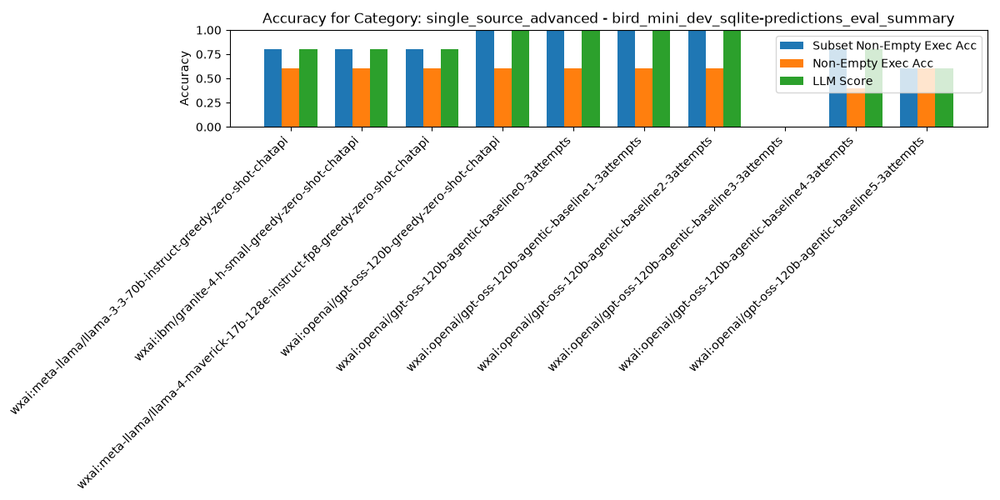

## Category: `single_source_basic`

| Rank | Pipeline | Records # | Predictions # | Exec Acc | Non-Empty Exec Acc | Subset Non-Empty Exec Acc | BIRD Exec Acc | Parsable SQL | Syntactic Equivalence Score | LLM Score |
| --- | --- | --- | --- | --- | --- | --- | --- | --- | --- | --- |
| 1 | wxai:openai/gpt-oss-120b-greedy-zero-shot-chatapi | 76 | 0 | 0.66 | 0.66 | 0.72 | 0.68 | 1.00 | 0.29 | 0.84 |
| 2 | wxai:ibm/granite-4-h-small-greedy-zero-shot-chatapi | 76 | 0 | 0.68 | 0.68 | 0.68 | 0.71 | 1.00 | 0.28 | 0.78 |
| 3 | wxai:meta-llama/llama-4-maverick-17b-128e-instruct-fp8-greedy-zero-shot-chatapi | 76 | 0 | 0.66 | 0.66 | 0.68 | 0.68 | 1.00 | 0.30 | 0.78 |
| 4 | wxai:meta-llama/llama-3-3-70b-instruct-greedy-zero-shot-chatapi | 76 | 0 | 0.63 | 0.63 | 0.63 | 0.68 | 1.00 | 0.30 | 0.78 |
| 5 | wxai:openai/gpt-oss-120b-agentic-baseline0-3attempts | 76 | 0 | 0.41 | 0.41 | 0.53 | 0.46 | 1.00 | 0.18 | 0.75 |
| 6 | wxai:openai/gpt-oss-120b-agentic-baseline1-3attempts | 76 | 0 | 0.47 | 0.47 | 0.53 | 0.53 | 1.00 | 0.25 | 0.72 |
| 7 | wxai:openai/gpt-oss-120b-agentic-baseline4-3attempts | 76 | 0 | 0.43 | 0.43 | 0.50 | 0.45 | 1.00 | 0.14 | 0.63 |
| 8 | wxai:openai/gpt-oss-120b-agentic-baseline2-3attempts | 76 | 0 | 0.45 | 0.45 | 0.49 | 0.50 | 1.00 | 0.25 | 0.80 |
| 9 | wxai:openai/gpt-oss-120b-agentic-baseline5-3attempts | 76 | 0 | 0.44 | 0.44 | 0.48 | 0.46 | 1.00 | 0.15 | 0.64 |
| 10 | wxai:openai/gpt-oss-120b-agentic-baseline3-3attempts | 76 | 0 | 0.00 | 0.00 | 0.01 | 0.00 | 1.00 | 0.21 | 0.03 |

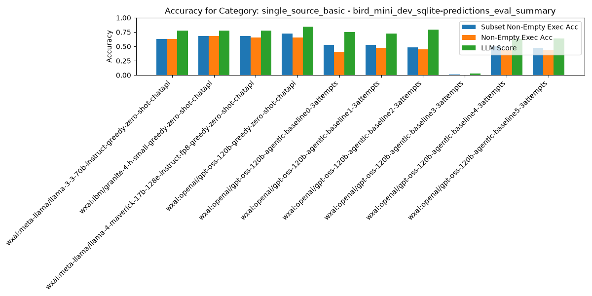

# Per-Pipeline Comparison Across Categories

### Pipeline: `wxai:ibm/granite-4-h-small-greedy-zero-shot-chatapi`
| Category | # Records | # Predictions | Exec Acc | Non-Empty Exec Acc | Subset Non-Empty Exec Acc | BIRD Exec Acc | LLM Score |
|---|---|---|---|---|---|---|---|
| All Categories | 500 | 0 | 0.408 | 0.408 | 0.436 | 0.426 | 0.562 |
| difficulty_challenging | 102 | 0 | 0.228 | 0.228 | 0.277 | 0.248 | 0.396 |
| difficulty_moderate | 250 | 0 | 0.390 | 0.390 | 0.418 | 0.406 | 0.548 |
| difficulty_simple | 148 | 0 | 0.561 | 0.561 | 0.574 | 0.581 | 0.699 |
| has_aggregation | 246 | 0 | 0.406 | 0.406 | 0.426 | 0.410 | 0.555 |
| has_join | 407 | 0 | 0.358 | 0.358 | 0.388 | 0.373 | 0.519 |
| has_nested_query | 64 | 0 | 0.306 | 0.306 | 0.339 | 0.339 | 0.492 |
| has_sorting | 105 | 0 | 0.433 | 0.433 | 0.481 | 0.442 | 0.577 |
| has_window_function | 5 | 0 | 0.200 | 0.200 | 0.600 | 0.200 | 0.600 |
| multi_table_simple | 357 | 0 | 0.370 | 0.370 | 0.398 | 0.384 | 0.528 |
| single_source_advanced | 5 | 0 | 0.600 | 0.600 | 0.800 | 0.600 | 0.800 |
| single_source_basic | 76 | 0 | 0.684 | 0.684 | 0.684 | 0.711 | 0.776 |

### Pipeline: `wxai:meta-llama/llama-3-3-70b-instruct-greedy-zero-shot-chatapi`
| Category | # Records | # Predictions | Exec Acc | Non-Empty Exec Acc | Subset Non-Empty Exec Acc | BIRD Exec Acc | LLM Score |
|---|---|---|---|---|---|---|---|
| All Categories | 500 | 0 | 0.506 | 0.506 | 0.542 | 0.548 | 0.706 |
| difficulty_challenging | 102 | 0 | 0.356 | 0.356 | 0.396 | 0.406 | 0.604 |
| difficulty_moderate | 250 | 0 | 0.514 | 0.514 | 0.550 | 0.542 | 0.695 |
| difficulty_simple | 148 | 0 | 0.595 | 0.595 | 0.628 | 0.655 | 0.794 |
| has_aggregation | 246 | 0 | 0.516 | 0.516 | 0.533 | 0.525 | 0.703 |
| has_join | 407 | 0 | 0.484 | 0.484 | 0.521 | 0.523 | 0.693 |
| has_nested_query | 64 | 0 | 0.452 | 0.452 | 0.500 | 0.500 | 0.685 |
| has_sorting | 105 | 0 | 0.510 | 0.510 | 0.596 | 0.510 | 0.702 |
| has_window_function | 5 | 0 | 0.200 | 0.200 | 0.800 | 0.200 | 1.000 |
| multi_table_simple | 357 | 0 | 0.493 | 0.493 | 0.527 | 0.532 | 0.692 |
| single_source_advanced | 5 | 0 | 0.600 | 0.600 | 0.800 | 0.600 | 0.800 |
| single_source_basic | 76 | 0 | 0.632 | 0.632 | 0.632 | 0.684 | 0.776 |

### Pipeline: `wxai:meta-llama/llama-4-maverick-17b-128e-instruct-fp8-greedy-zero-shot-chatapi`
| Category | # Records | # Predictions | Exec Acc | Non-Empty Exec Acc | Subset Non-Empty Exec Acc | BIRD Exec Acc | LLM Score |
|---|---|---|---|---|---|---|---|
| All Categories | 500 | 0 | 0.532 | 0.532 | 0.564 | 0.560 | 0.734 |
| difficulty_challenging | 102 | 0 | 0.426 | 0.426 | 0.455 | 0.465 | 0.703 |
| difficulty_moderate | 250 | 0 | 0.514 | 0.514 | 0.550 | 0.534 | 0.715 |
| difficulty_simple | 148 | 0 | 0.635 | 0.635 | 0.662 | 0.669 | 0.787 |
| has_aggregation | 246 | 0 | 0.549 | 0.549 | 0.557 | 0.553 | 0.734 |
| has_join | 407 | 0 | 0.509 | 0.509 | 0.538 | 0.536 | 0.725 |
| has_nested_query | 64 | 0 | 0.452 | 0.452 | 0.484 | 0.500 | 0.710 |
| has_sorting | 105 | 0 | 0.548 | 0.548 | 0.625 | 0.538 | 0.726 |
| has_window_function | 5 | 0 | 0.200 | 0.200 | 0.600 | 0.200 | 0.600 |
| multi_table_simple | 357 | 0 | 0.524 | 0.524 | 0.552 | 0.549 | 0.730 |
| single_source_advanced | 5 | 0 | 0.600 | 0.600 | 0.800 | 0.600 | 0.800 |
| single_source_basic | 76 | 0 | 0.658 | 0.658 | 0.684 | 0.684 | 0.776 |

### Pipeline: `wxai:openai/gpt-oss-120b-agentic-baseline0-3attempts`
| Category | # Records | # Predictions | Exec Acc | Non-Empty Exec Acc | Subset Non-Empty Exec Acc | BIRD Exec Acc | LLM Score |
|---|---|---|---|---|---|---|---|
| All Categories | 500 | 0 | 0.317 | 0.317 | 0.420 | 0.351 | 0.720 |
| difficulty_challenging | 102 | 0 | 0.158 | 0.158 | 0.257 | 0.198 | 0.693 |
| difficulty_moderate | 250 | 0 | 0.297 | 0.297 | 0.394 | 0.333 | 0.693 |
| difficulty_simple | 148 | 0 | 0.459 | 0.459 | 0.574 | 0.486 | 0.784 |
| has_aggregation | 246 | 0 | 0.291 | 0.291 | 0.381 | 0.291 | 0.715 |
| has_join | 407 | 0 | 0.299 | 0.299 | 0.393 | 0.328 | 0.712 |
| has_nested_query | 64 | 0 | 0.258 | 0.258 | 0.355 | 0.323 | 0.766 |
| has_sorting | 105 | 0 | 0.240 | 0.240 | 0.462 | 0.250 | 0.769 |
| has_window_function | 5 | 0 | 0.200 | 0.200 | 0.200 | 0.200 | 0.400 |
| multi_table_simple | 357 | 0 | 0.311 | 0.311 | 0.412 | 0.336 | 0.709 |
| single_source_advanced | 5 | 0 | 0.600 | 0.600 | 1.000 | 0.600 | 1.000 |
| single_source_basic | 76 | 0 | 0.408 | 0.408 | 0.526 | 0.461 | 0.750 |

### Pipeline: `wxai:openai/gpt-oss-120b-agentic-baseline1-3attempts`
| Category | # Records | # Predictions | Exec Acc | Non-Empty Exec Acc | Subset Non-Empty Exec Acc | BIRD Exec Acc | LLM Score |
|---|---|---|---|---|---|---|---|
| All Categories | 500 | 0 | 0.398 | 0.398 | 0.444 | 0.422 | 0.678 |
| difficulty_challenging | 102 | 0 | 0.257 | 0.257 | 0.307 | 0.267 | 0.644 |
| difficulty_moderate | 250 | 0 | 0.373 | 0.373 | 0.418 | 0.398 | 0.643 |
| difficulty_simple | 148 | 0 | 0.534 | 0.534 | 0.581 | 0.568 | 0.760 |
| has_aggregation | 246 | 0 | 0.369 | 0.369 | 0.393 | 0.369 | 0.662 |
| has_join | 407 | 0 | 0.383 | 0.383 | 0.420 | 0.402 | 0.668 |
| has_nested_query | 64 | 0 | 0.339 | 0.339 | 0.403 | 0.355 | 0.710 |
| has_sorting | 105 | 0 | 0.365 | 0.365 | 0.500 | 0.365 | 0.683 |
| has_window_function | 5 | 0 | 0.400 | 0.400 | 0.400 | 0.400 | 0.600 |
| multi_table_simple | 357 | 0 | 0.392 | 0.392 | 0.434 | 0.412 | 0.662 |
| single_source_advanced | 5 | 0 | 0.600 | 0.600 | 1.000 | 0.600 | 1.000 |
| single_source_basic | 76 | 0 | 0.474 | 0.474 | 0.526 | 0.526 | 0.724 |

### Pipeline: `wxai:openai/gpt-oss-120b-agentic-baseline2-3attempts`
| Category | # Records | # Predictions | Exec Acc | Non-Empty Exec Acc | Subset Non-Empty Exec Acc | BIRD Exec Acc | LLM Score |
|---|---|---|---|---|---|---|---|
| All Categories | 500 | 0 | 0.386 | 0.386 | 0.442 | 0.414 | 0.684 |
| difficulty_challenging | 102 | 0 | 0.267 | 0.267 | 0.347 | 0.297 | 0.653 |
| difficulty_moderate | 250 | 0 | 0.345 | 0.345 | 0.398 | 0.382 | 0.641 |
| difficulty_simple | 148 | 0 | 0.534 | 0.534 | 0.581 | 0.547 | 0.777 |
| has_aggregation | 246 | 0 | 0.361 | 0.361 | 0.389 | 0.365 | 0.660 |
| has_join | 407 | 0 | 0.375 | 0.375 | 0.425 | 0.400 | 0.662 |
| has_nested_query | 64 | 0 | 0.306 | 0.306 | 0.403 | 0.339 | 0.661 |
| has_sorting | 105 | 0 | 0.394 | 0.394 | 0.500 | 0.394 | 0.697 |
| has_window_function | 5 | 0 | 0.400 | 0.400 | 0.400 | 0.400 | 0.400 |
| multi_table_simple | 357 | 0 | 0.387 | 0.387 | 0.440 | 0.409 | 0.667 |
| single_source_advanced | 5 | 0 | 0.600 | 0.600 | 1.000 | 0.600 | 1.000 |
| single_source_basic | 76 | 0 | 0.447 | 0.447 | 0.487 | 0.500 | 0.796 |

### Pipeline: `wxai:openai/gpt-oss-120b-agentic-baseline3-3attempts`
| Category | # Records | # Predictions | Exec Acc | Non-Empty Exec Acc | Subset Non-Empty Exec Acc | BIRD Exec Acc | LLM Score |
|---|---|---|---|---|---|---|---|
| All Categories | 500 | 0 | 0.020 | 0.020 | 0.030 | 0.020 | 0.066 |
| difficulty_challenging | 102 | 0 | 0.050 | 0.050 | 0.059 | 0.050 | 0.114 |
| difficulty_moderate | 250 | 0 | 0.020 | 0.020 | 0.024 | 0.020 | 0.066 |
| difficulty_simple | 148 | 0 | 0.000 | 0.000 | 0.020 | 0.000 | 0.034 |
| has_aggregation | 246 | 0 | 0.020 | 0.020 | 0.020 | 0.020 | 0.061 |
| has_join | 407 | 0 | 0.025 | 0.025 | 0.035 | 0.025 | 0.074 |
| has_nested_query | 64 | 0 | 0.016 | 0.016 | 0.016 | 0.016 | 0.056 |
| has_sorting | 105 | 0 | 0.010 | 0.010 | 0.029 | 0.010 | 0.082 |
| has_window_function | 5 | 0 | 0.000 | 0.000 | 0.000 | 0.000 | 0.000 |
| multi_table_simple | 357 | 0 | 0.025 | 0.025 | 0.036 | 0.025 | 0.077 |
| single_source_advanced | 5 | 0 | 0.000 | 0.000 | 0.000 | 0.000 | 0.000 |
| single_source_basic | 76 | 0 | 0.000 | 0.000 | 0.013 | 0.000 | 0.026 |

### Pipeline: `wxai:openai/gpt-oss-120b-agentic-baseline4-3attempts`
| Category | # Records | # Predictions | Exec Acc | Non-Empty Exec Acc | Subset Non-Empty Exec Acc | BIRD Exec Acc | LLM Score |
|---|---|---|---|---|---|---|---|
| All Categories | 500 | 0 | 0.362 | 0.362 | 0.431 | 0.377 | 0.661 |
| difficulty_challenging | 102 | 0 | 0.244 | 0.244 | 0.311 | 0.256 | 0.594 |
| difficulty_moderate | 250 | 0 | 0.331 | 0.331 | 0.401 | 0.355 | 0.653 |
| difficulty_simple | 148 | 0 | 0.486 | 0.486 | 0.555 | 0.486 | 0.716 |
| has_aggregation | 246 | 0 | 0.325 | 0.325 | 0.381 | 0.320 | 0.615 |
| has_join | 407 | 0 | 0.351 | 0.351 | 0.410 | 0.364 | 0.662 |
| has_nested_query | 64 | 0 | 0.286 | 0.286 | 0.393 | 0.321 | 0.696 |
| has_sorting | 105 | 0 | 0.303 | 0.303 | 0.495 | 0.293 | 0.717 |
| has_window_function | 5 | 0 | 0.500 | 0.500 | 0.500 | 0.500 | 0.500 |
| multi_table_simple | 357 | 0 | 0.359 | 0.359 | 0.423 | 0.370 | 0.665 |
| single_source_advanced | 5 | 0 | 0.400 | 0.400 | 0.800 | 0.400 | 0.800 |
| single_source_basic | 76 | 0 | 0.434 | 0.434 | 0.500 | 0.447 | 0.632 |

### Pipeline: `wxai:openai/gpt-oss-120b-agentic-baseline5-3attempts`
| Category | # Records | # Predictions | Exec Acc | Non-Empty Exec Acc | Subset Non-Empty Exec Acc | BIRD Exec Acc | LLM Score |
|---|---|---|---|---|---|---|---|
| All Categories | 500 | 0 | 0.317 | 0.317 | 0.336 | 0.336 | 0.492 |
| difficulty_challenging | 102 | 0 | 0.127 | 0.127 | 0.141 | 0.155 | 0.324 |
| difficulty_moderate | 250 | 0 | 0.242 | 0.242 | 0.260 | 0.251 | 0.425 |
| difficulty_simple | 148 | 0 | 0.532 | 0.532 | 0.554 | 0.561 | 0.683 |
| has_aggregation | 246 | 0 | 0.289 | 0.289 | 0.299 | 0.289 | 0.471 |
| has_join | 407 | 0 | 0.282 | 0.282 | 0.293 | 0.299 | 0.453 |
| has_nested_query | 64 | 0 | 0.294 | 0.294 | 0.314 | 0.353 | 0.471 |
| has_sorting | 105 | 0 | 0.341 | 0.341 | 0.366 | 0.341 | 0.482 |
| has_window_function | 5 | 0 | 0.250 | 0.250 | 0.250 | 0.250 | 0.500 |
| multi_table_simple | 357 | 0 | 0.295 | 0.295 | 0.308 | 0.305 | 0.461 |
| single_source_advanced | 5 | 0 | 0.600 | 0.600 | 0.600 | 0.600 | 0.600 |
| single_source_basic | 76 | 0 | 0.437 | 0.437 | 0.479 | 0.465 | 0.641 |

### Pipeline: `wxai:openai/gpt-oss-120b-greedy-zero-shot-chatapi`
| Category | # Records | # Predictions | Exec Acc | Non-Empty Exec Acc | Subset Non-Empty Exec Acc | BIRD Exec Acc | LLM Score |
|---|---|---|---|---|---|---|---|
| All Categories | 500 | 0 | 0.512 | 0.512 | 0.574 | 0.534 | 0.790 |
| difficulty_challenging | 102 | 0 | 0.406 | 0.406 | 0.465 | 0.426 | 0.772 |
| difficulty_moderate | 250 | 0 | 0.486 | 0.486 | 0.542 | 0.510 | 0.767 |
| difficulty_simple | 148 | 0 | 0.628 | 0.628 | 0.703 | 0.649 | 0.841 |
| has_aggregation | 246 | 0 | 0.508 | 0.508 | 0.553 | 0.520 | 0.801 |
| has_join | 407 | 0 | 0.491 | 0.491 | 0.541 | 0.511 | 0.777 |
| has_nested_query | 64 | 0 | 0.355 | 0.355 | 0.452 | 0.419 | 0.790 |
| has_sorting | 105 | 0 | 0.433 | 0.433 | 0.587 | 0.442 | 0.817 |
| has_window_function | 5 | 0 | 0.200 | 0.200 | 0.200 | 0.400 | 0.800 |
| multi_table_simple | 357 | 0 | 0.513 | 0.513 | 0.569 | 0.524 | 0.780 |
| single_source_advanced | 5 | 0 | 0.600 | 0.600 | 1.000 | 0.600 | 1.000 |
| single_source_basic | 76 | 0 | 0.658 | 0.658 | 0.724 | 0.684 | 0.842 |