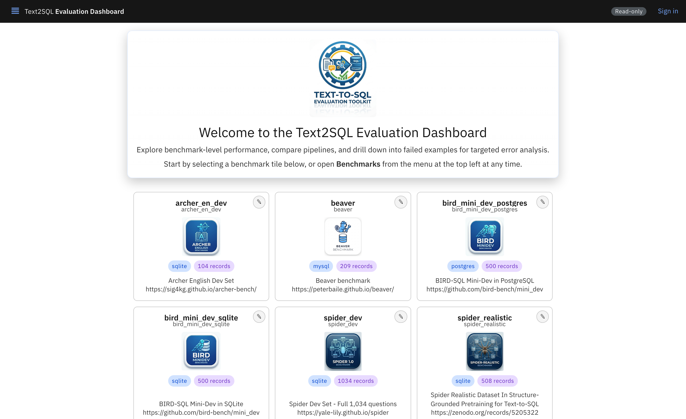
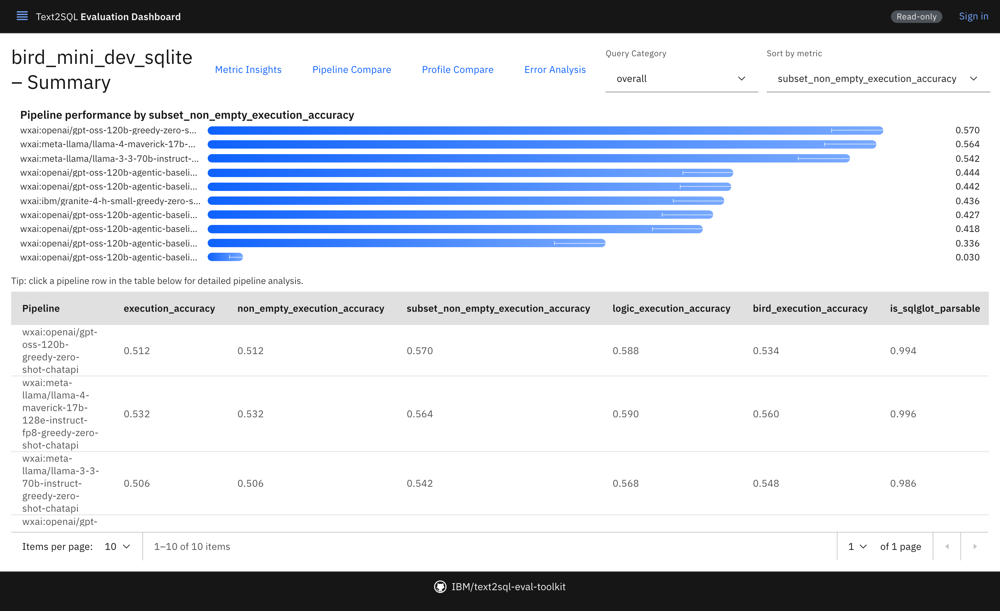
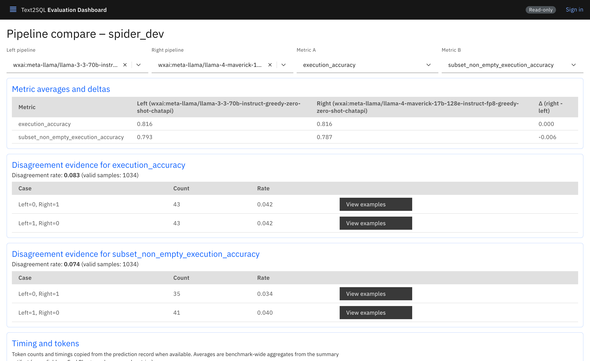
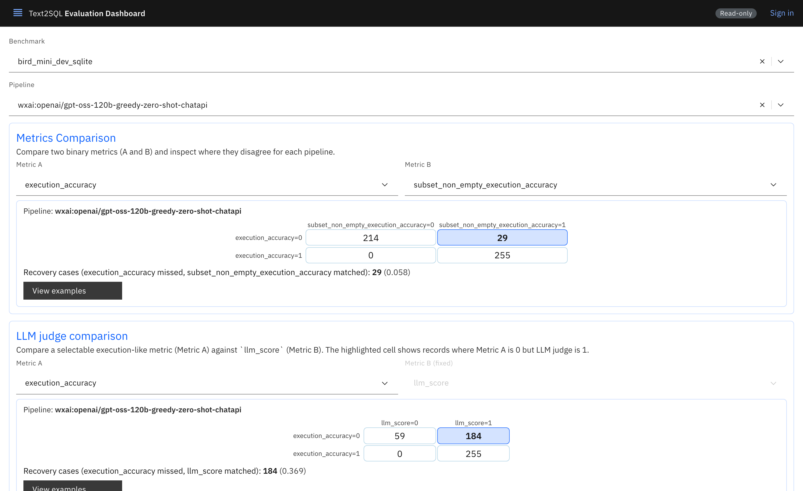
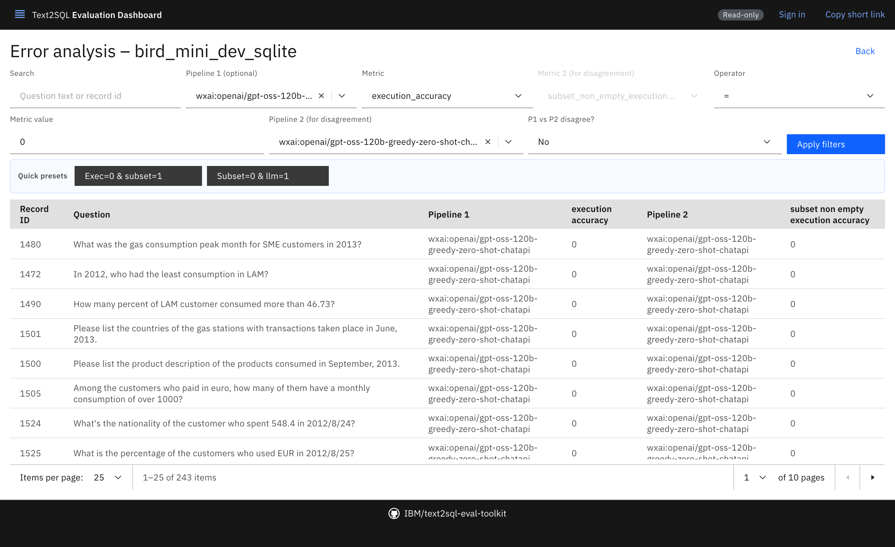
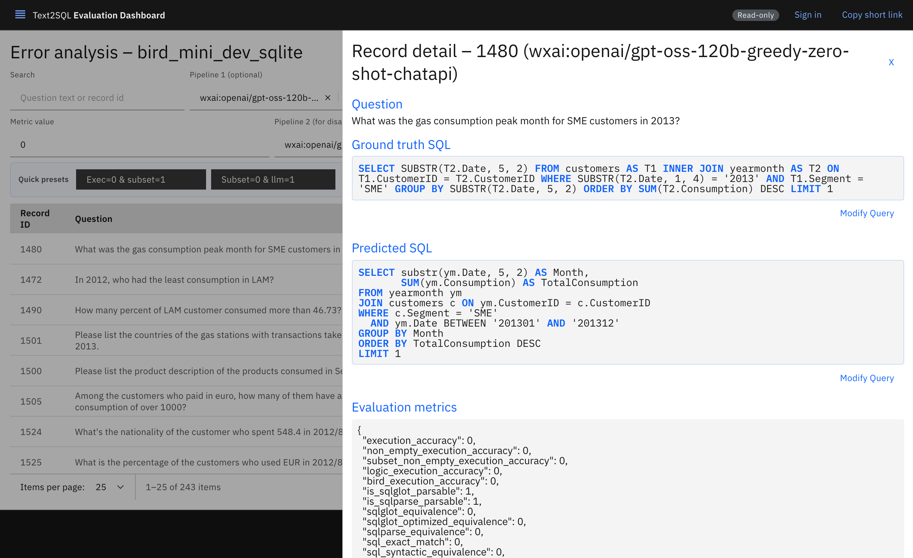
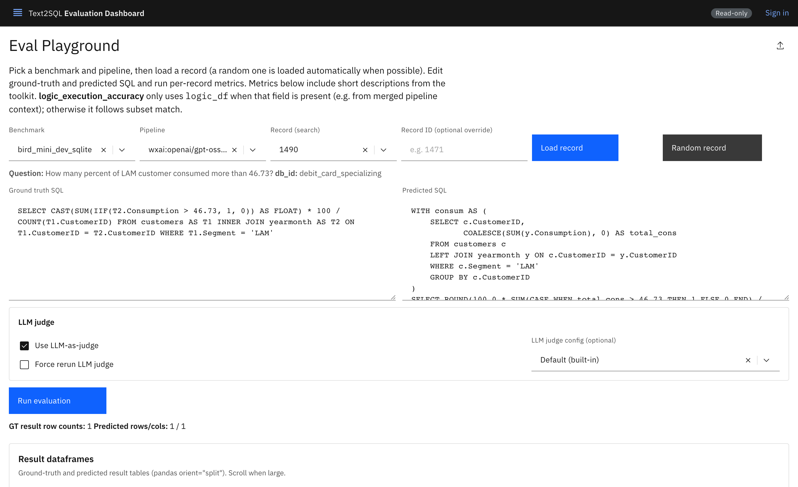
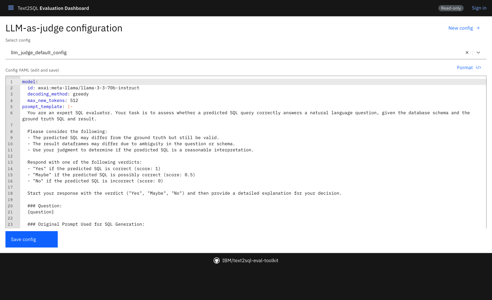

# A tour of the dashboard

> **The links on this page only work in a running dashboard.** They are
> addresses within the application — `/compare?benchmark=spider_dev` and the
> like — so they resolve when you are reading this *inside* the dashboard, and
> they do not resolve when you are reading the file on GitHub. The screenshots
> and the numbers work either way. A public deployment is at
> <https://text2sql-eval-toolkit.oaklayer.dev/docs/dashboard-tour>.

Every screen below is part of this dashboard, and every link opens the real
thing with real results loaded. Nothing here is a mock-up — the numbers quoted
are the ones the linked page will show you.

The argument the tour makes: **a text-to-SQL leaderboard number is a summary of
a summary, and this toolkit gives you back the two layers underneath it.**

---

## Start here: the benchmarks

[**Open the dashboard →**](/)

Six benchmarks are loaded: BIRD Mini-Dev in both SQLite and PostgreSQL, Spider
Dev and Spider Realistic, Archer, and Beaver — an enterprise-style benchmark on
MySQL. A benchmark here is a set of questions, a database, and one or more
reference queries per question.

Everything downstream is stored per record. There is no aggregate in this
dashboard that you cannot open.

---

## The number everyone quotes

[**Open BIRD Mini-Dev (SQLite) →**](/benchmark/bird_mini_dev_sqlite)

One row per pipeline, one column per metric. This is the leaderboard view — the
numbers a paper would report.

On this benchmark, `gemini-3-flash` leads at **0.616** execution accuracy, ahead
of `llama-4-maverick` at 0.530 and `gpt-oss-120b` at 0.510. The agentic variants
of `gpt-oss-120b` all score *lower* than its plain zero-shot run, which is worth
knowing before assuming more machinery helps.

Then the thing the rest of the tour is about: **these metrics disagree with each
other, and the disagreement is the finding.**

---

## Two systems, the same score, different behaviour

[**Compare two pipelines on Spider Dev →**](/compare?benchmark=spider_dev)

This is the screen that changes how people read a leaderboard.

`llama-3-3-70b` and `llama-4-maverick` score **exactly the same** on Spider Dev:
0.816 execution accuracy each, a delta of 0.000. By the headline number they are
interchangeable.

They are not. They **disagree on 86 of the 1,034 records** — 43 that the first
gets right and the second does not, and 43 the other way. An 8.3% disagreement
rate, entirely invisible in the average.

Every one of those cells has a **View examples** button that takes you to the
records behind it.

---

## Where two metrics disagree

[**Open metric insights →**](/insights?benchmark=bird_mini_dev_sqlite)

Confusion matrices between two binary metrics, per pipeline. For
`gpt-oss-120b` on BIRD Mini-Dev:

- **29 records (5.8%)** fail strict execution match but pass the relaxed subset
  comparison — right answer, extra column or different column order.
- **184 records (36.9%)** fail execution match while the LLM judge says the
  prediction is correct.

That second number is the one to sit with. On more than a third of this
benchmark, "execution accuracy" and "an LLM reading the question" reach opposite
conclusions. Neither is automatically right. Both are reported by the same run.

---

## Reading one record

[**Open error analysis →**](/errors?benchmark=bird_mini_dev_sqlite&pipeline=wxai%3Aopenai%2Fgpt-oss-120b-greedy-zero-shot-chatapi&metric=execution_accuracy&value=0)

Filter by pipeline and metric, search by question text or record id, or use the
**Quick presets** — `Exec=0 & subset=1` and `Subset=0 & llm=1` are the two
disagreement filters from the section above, one click away.

Then open a record.

[**Open record 1480 →**](/errors?benchmark=bird_mini_dev_sqlite&pipeline=wxai%3Aopenai%2Fgpt-oss-120b-greedy-zero-shot-chatapi&metric=execution_accuracy&value=0&record=1480)

The question, the reference SQL, the generated SQL, both result tables and every
metric computed for the pair. This is the layer under the layer.

Record 1480 asks for *"the gas consumption peak month for SME customers in
2013"*. The reference returns one column — the month. The prediction returns
two: `Month` and `TotalConsumption`, and gets the month right. `execution_accuracy`
is 0, because strict comparison requires the tables to match.

Whether that is a failure depends entirely on who is reading the answer. A
person is fine with the extra column; a program indexing into column 0 is not.
The toolkit reports both readings and lets you decide which one your project
means — it does not decide for you.

The same record on the [PostgreSQL
version](/errors?benchmark=bird_mini_dev_postgres&pipeline=wxai%3Ameta-llama%2Fllama-3-3-70b-instruct-greedy-zero-shot-chatapi&metric=execution_accuracy&value=0&record=1480)
of the benchmark carries a judge verdict in its `llm_explanation` field, which
opens *"Yes — The predicted SQL query is correct"* against an execution accuracy
of 0. Scroll the metric block to read it.

---

## Run one yourself

[**Open the Eval Playground →**](/run/bird_mini_dev_sqlite/record/1480?pipeline=wxai%3Aopenai%2Fgpt-oss-120b-greedy-zero-shot-chatapi)

Edit a query, run it, evaluate it, and — where the deployment allows it — run
the LLM judge on the result and read the verdict.

Two things worth knowing:

- A verdict is cached against the record, the pipeline, the config name **and a
  digest of the config's contents**. Re-running an unchanged judge costs
  nothing; changing a word in the prompt invalidates it. That is what makes a
  judge score reproducible rather than a coin flip.
- Once a verdict is showing, the address carries the judge config. **That link
  restores the same verdict for whoever you send it to** — and opening it reads
  the cache only. It never starts an inference, because sharing an answer is not
  authorisation to spend someone else's budget.

---

## The judge is configuration, not a black box

[**Open the judge configuration →**](/llm-judge)

The judge is a model id, a few generation parameters and a prompt template, kept
as YAML and editable here with syntax highlighting, a **Format** action and
errors marked at the line and column.

Four configs ship with the toolkit, differing in how much they are told and
whether they see the ground truth at all. Judging *without* the ground truth is
a genuinely different measurement: it asks whether the query answers the
question, rather than whether it matches someone else's answer.

Edits are saved to the data root and shadow the packaged config of the same
name; deleting the copy restores the original.

---

## Where to go next

- [**State of the art in Text-to-SQL Evaluation**](/docs/text-to-sql-evaluation-survey)
  — a survey of the field: what each family of metrics measures, which
  benchmarks pushed which direction, and where each method misleads.
- [**Worked examples: when the metrics disagree**](/docs/worked-examples) — the
  six recurring shapes, what each means, and what to do about it.
- [**API reference**](https://text2sql-eval-toolkit.readthedocs.io/en/latest/)
  — every exported symbol, for running the toolkit yourself.

---

*Every view in this dashboard is a real address. Anything shown here can be
linked to in an issue or a paper and will reopen on the same record.*
