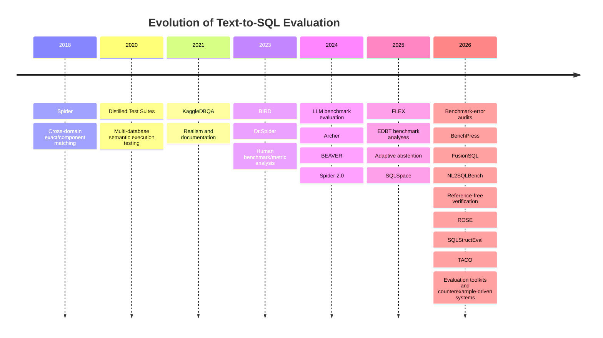
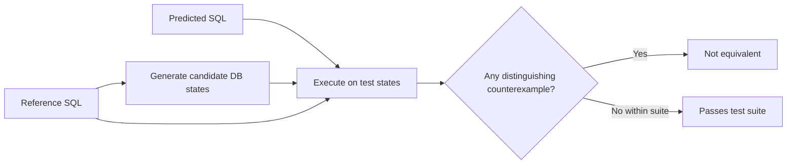
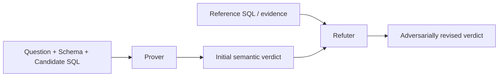
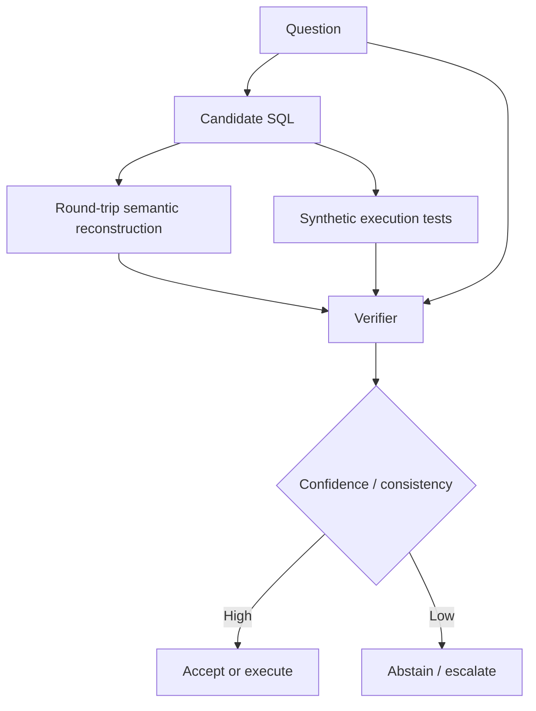
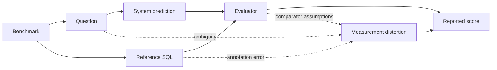
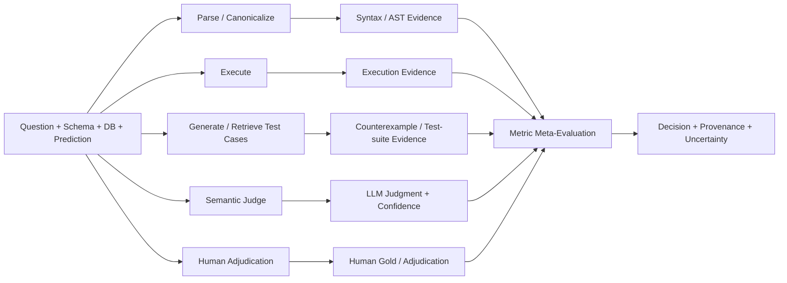
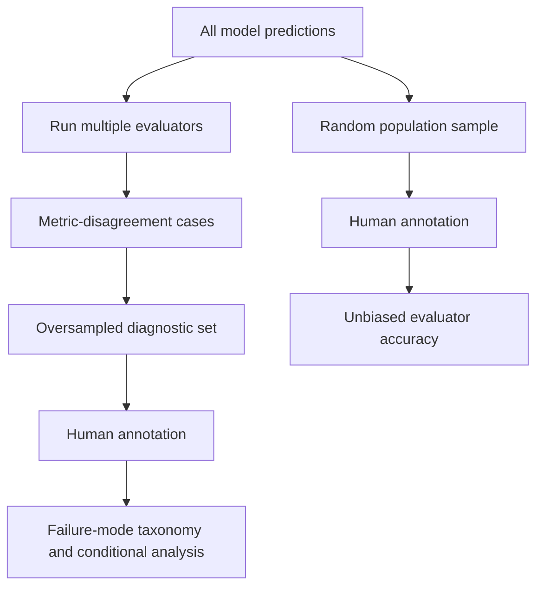
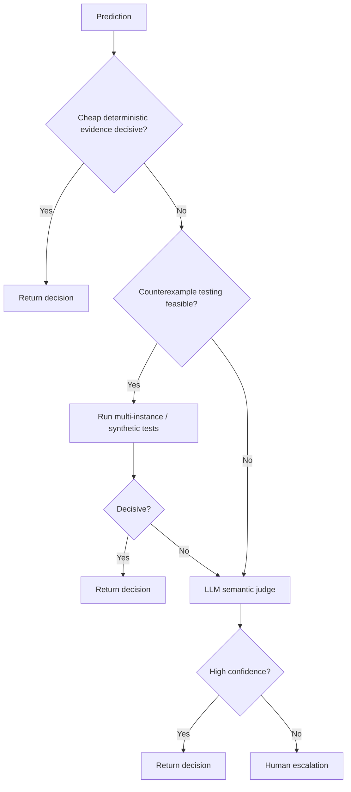
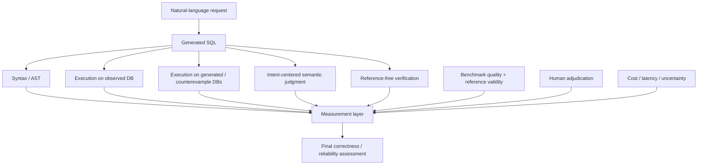

# State of the art in Text-to-SQL Evaluation

> **Survey**
>
> **Keywords:** Text-to-SQL; NL2SQL; evaluation; execution accuracy; semantic equivalence; benchmarks; LLM-as-judge; verification; robustness.

---

## Abstract

Text-to-SQL evaluation has evolved from exact matching of generated SQL strings to a broader measurement problem involving program semantics, user intent, benchmark validity, robustness, reliability, and deployment constraints. Execution accuracy (EX) remains the dominant metric because it accepts many syntactically distinct queries that produce the same result. Yet EX is only a one-instance behavioral test: non-equivalent queries can coincide on a particular database state, while correct predictions can be rejected because of annotation errors, underspecified questions, alternative valid projections, ordering and duplicate conventions, or database-engine behavior.

Recent work therefore moves in several complementary directions: multi-instance test suites and counterexample generation, expert-calibrated LLM judges, intent-centered evaluation, reference-free verification, benchmark audits, module-level and workload-aware evaluation frameworks, and label-free estimation of aggregate model quality on unseen workloads. This survey organizes these developments into a unified taxonomy and reviews the corresponding metrics, benchmarks, frameworks, and evaluation practices.

A central conclusion is that Text-to-SQL correctness is best viewed as **equivalence under intended semantics**, not as similarity to a single reference query or equality on a single database instance. Consequently, no single scalar metric is sufficient for all evaluation settings. Reliable evaluation increasingly requires layered evidence, explicit comparator policies, benchmark versioning, human-grounded meta-evaluation, and uncertainty-aware escalation from cheap deterministic checks to stronger semantic verification.

---

# 1. Introduction

Text-to-SQL systems translate natural-language information needs into executable SQL queries. For much of the field's history, evaluation appeared straightforward: compare a predicted query with a reference query, either syntactically or by executing both and comparing their outputs. The success of Spider [1] made cross-domain evaluation standard, and later benchmarks such as BIRD [5] expanded the task toward larger databases, noisy values, external knowledge, and efficiency. The emergence of large language models has further increased the apparent maturity of Text-to-SQL systems, with strong systems achieving high scores on established benchmarks and increasingly being evaluated in enterprise and agentic settings [7, 9, 10].

At the same time, evaluation has become one of the main methodological bottlenecks. SQL admits many semantically equivalent formulations, and the natural-language question may itself admit several legitimate interpretations. A reference SQL statement is therefore an example of a correct realization, not necessarily a complete specification of user intent. Execution-based evaluation improves over string matching, but equality of outputs on one populated database does not imply semantic equivalence over other admissible database states [2]. Conversely, execution mismatch does not necessarily imply that a prediction is wrong: the reference may be defective, the question may be underspecified, or the comparator may impose a convention—such as column order or duplicate handling—that is not licensed by the question [6, 12, 15].

The evaluation problem has consequently broadened along two dimensions. First, the field has sought stronger correctness evidence: distilled test suites, counterexamples, LLM-mediated semantic judgment, hybrid result matching, and reference-free verification. Second, the object being measured has expanded beyond one-shot query correctness to include benchmark quality, robustness under perturbation, structural stability, multi-turn stateful behavior, system-module quality, computational cost, abstention, and expected accuracy on new unlabeled workloads [4, 17–19, 23–28]. These developments are not interchangeable. They answer different questions and rely on different notions of correctness.

This survey develops a **measurement-oriented view** of Text-to-SQL evaluation. Rather than treating evaluation as a final script applied after generation, it treats the evaluator as a system whose assumptions, evidence, and failure modes must themselves be studied. Four distinctions are particularly useful:

1. **Syntactic resemblance vs. one-instance execution vs. semantic equivalence vs. intent satisfaction.**
2. **Reference-dependent vs. intent-dependent vs. reference-free vs. distribution-level vs. behavioral evaluation.**
3. **Benchmark evolution as a change in what the community expects Text-to-SQL systems to handle.**
4. **Evaluation of evaluators through human adjudication, disagreement analysis, rank sensitivity, uncertainty, and reproducibility.**

## 1.1 Evolution of Text-to-SQL Evaluation

The trajectory is not merely one of increasingly sophisticated metrics. It is a shift from asking **“Does the SQL look like the reference?”** to **“What evidence justifies the claim that this output satisfies the intended information need?”**

---

# 2. What Does Correctness Mean in Text-to-SQL?

Let \(q\) denote a natural-language question, \(S\) a database schema, \(D\) a populated database instance, \(p\) a predicted SQL query, and \(g\) a benchmark reference query. The weakest automated notion is **syntactic equivalence**: \(p\) and \(g\) are identical after some normalization. A stronger notion is **denotational equality on \(D\)**: executing \(p\) and \(g\) on the observed database yields equal result relations. Stronger still is **semantic equivalence over a class of legal database states**, where \(p\) and \(g\) agree for every state consistent with the schema and relevant integrity constraints. The most task-faithful notion is **intent satisfaction**: the predicted query returns an answer that satisfies the user's intended information need, whether or not it is equivalent to the particular reference.

### The hierarchy of evaluation targets

\[
\text{syntactic equality}
\;\subsetneq\;
\text{one-instance behavioral equality}
\;\not\equiv\;
\text{semantic equivalence}
\;\not\equiv\;
\text{intent satisfaction}
\]

These notions are related but not interchangeable. Syntactic equality is sufficient but not necessary for semantic equivalence. Equality on one database state is not sufficient for semantic equivalence. Equality with one reference is not always necessary for intent satisfaction. A benchmark reference can itself be wrong, incomplete, or based on one interpretation of an ambiguous question [6, 15].

For evaluation purposes, it is therefore useful to view the accepted answer as a set:

\[
A(q,S,D)=\{\text{all semantically acceptable outcomes for the request}\}
\]

rather than as one fixed SQL statement. Conventional benchmarks approximate this set with one query \(g\); multi-reference benchmarks approximate it with several queries; test-suite methods approximate equivalence by probing multiple database states; intent-centered judges attempt to reason about \(A\) directly from the question, schema, database, and supporting evidence.

> **Key observation.** A metric can be internally consistent and still measure the wrong construct. Exact match may faithfully measure canonical program similarity while missing valid rewrites. EX may faithfully measure one-state result equality while missing counterexamples. An LLM judge may better approximate intent satisfaction while introducing model and prompt sensitivity.

## 2.1 Taxonomy by Evidence Source

| Evaluation class | Primary evidence | Representative methods | Main question answered |
|---|---|---|---|
| **Reference-dependent** | Gold SQL and/or gold result | Exact match, component match, EX, test-suite accuracy, VES | How closely does the prediction agree with benchmark reference behavior? |
| **Intent-dependent** | Question, schema, data, prediction; reference may be secondary evidence | FLEX, ROSE, expert semantic judgment | Does the prediction satisfy the user's intended request? |
| **Reference-free verification** | Question, schema/data, candidate SQL; no gold SQL required | Round-trip critique, synthetic execution consistency | Can the candidate be falsified or shown inconsistent with the request? |
| **Distribution-level** | Model outputs and workload-shift features | FusionSQL | What accuracy should be expected on a new unlabeled workload? |
| **Behavioral / reliability** | Perturbations, modules, interaction traces, state transitions | Dr.Spider, NL2SQLBench, SQLStructEval, DySQL-Bench, VET | How stable, diagnosable, efficient, and reliable is the system beyond one final query? |

---

# 3. Metrics and Evaluation Techniques

## 3.1 Syntactic and Structural Metrics

Early Text-to-SQL evaluation relied on exact string match and later on normalized or component-level comparisons. Spider popularized exact-set and component matching after parsing SQL into clause-level structures [1]. These metrics are deterministic, inexpensive, and valuable for diagnostics: they can reveal whether errors concentrate in `SELECT`, `WHERE`, `GROUP BY`, `ORDER BY`, set operations, or nested subqueries.

Canonicalization can remove irrelevant variation in whitespace, casing, identifier quoting, aliases, selected commutative expressions, and parser-normalized AST structure. The central limitation is that SQL syntax is not a canonical representation of meaning. Two correct queries may use joins versus correlated subqueries, CTEs versus nested views, alternative aggregation formulations, or logically equivalent predicates. Structural metrics therefore measure resemblance to a reference program rather than correctness in general.

Recent work such as SQLStructEval [24] turns this limitation into a useful diagnostic target: canonical abstract syntax trees can be used to measure structural consistency under paraphrases or schema-presentation changes. This is best interpreted as a **reliability dimension**, not as a semantic oracle.

\[
\boxed{\text{Canonicalization} \neq \text{Semantic Equivalence}}
\]

## 3.2 Execution Accuracy and Result-Comparator Policies

Execution accuracy (EX) evaluates \(p\) and \(g\) by running both on \(D\) and comparing their returned results. EX accepts many syntactically different but behaviorally equivalent queries and remains the standard semantic baseline.

However, EX actually combines two independent decisions: **which database state should be tested**, and **how should the outputs be compared**. Implementations differ in their treatment of projected column order, row order, duplicates, `NULL`, numeric precision and tolerance, aliases, empty outputs, execution errors, and timeouts.

### Comparator policies

| Comparator policy | Interpretation |
|---|---|
| **Relational-result strict** | Preserve projected columns and duplicate multiplicity; enforce row order when semantically demanded. |
| **Relational-result canonical** | Normalize representation-only differences such as harmless aliases or selected numeric formatting. |
| **Question-conditioned relaxed** | Permit output alternatives only when the natural-language question leaves representation underspecified. |
| **Counterexample/test-suite semantic** | Seek additional database states that can distinguish the prediction from the reference. |

The third policy is particularly important. A global “ignore column order” or “allow column subsets” switch is not semantically safe. Whether such a relaxation is legitimate depends on the natural-language request.

EX also has a deeper limitation: two non-equivalent queries may happen to agree on the observed database. Empty or sparse tables, coincidental value distributions, redundant predicates, and unused join paths can all create false positives.

## 3.3 Multi-Instance Test Suites and Counterexample-Driven Evaluation

Zhong, Yu, and Klein [2] proposed **distilled test-suite accuracy** to reduce false positives from single-instance execution. The method generates multiple database instances and selects a compact set that distinguishes the gold query from plausible incorrect variants.

The approach provides stronger evidence for semantic equivalence while remaining deterministic once the suite is fixed. The same program-testing perspective reappears in newer work. Reference-free verification constructs synthetic inputs or unit-test-like cases designed to expose semantic inconsistencies [19], while ParSEval [22] explores interactive counterexample-driven evaluation.

> **When one database state underdetermines correctness, search for another state on which competing interpretations diverge.**

The open challenge is generating high-coverage test states that preserve keys, foreign keys, domain constraints, and realistic business semantics.

## 3.4 Efficiency-Aware and Soft Result Metrics

Correctness is not the only property of executable SQL. BIRD introduced efficiency-oriented evaluation, including variants that reward correct queries whose execution efficiency compares favorably with a reference. Such metrics are useful when generated SQL will run repeatedly or over large databases, but they inherit DBMS- and configuration-specific noise. The reference SQL is also not necessarily optimizer-independent evidence of the best achievable formulation. Efficiency should therefore be reported **alongside**, rather than conflated with, semantic correctness.

Soft result metrics assign partial credit based on overlap among rows or cells. They can reveal near misses that binary EX hides, but partial output overlap is not necessarily partial semantic correctness. A broad query returning many irrelevant rows may obtain a deceptively favorable overlap score.

Hybrid approaches attempt to use learned alignment only for representation mapping and retain deterministic result comparison for the final decision. BADGER's Hybrid-EX [26], for example, uses an LLM to infer structural alignment before deterministic cell-level scoring and reports substantial agreement with human annotations on an enterprise dataset.

## 3.5 LLM-as-Judge and Intent-Centered Evaluation

Large language models make it possible to evaluate SQL with access to richer context than a conventional comparator can use.

### FLEX

FLEX [12] gives an LLM the information and criteria needed to emulate expert semantic evaluation. Against human judgments, FLEX reports substantially higher agreement than the execution baseline and shows that re-evaluation can change both absolute scores and leaderboard orderings. Its error analysis is especially important: LLM judging is not simply a more permissive EX. Difficult questions can be overestimated.

### ROSE

ROSE [23] makes user intent explicit and reduces direct dependence on the reference through an adversarial **Prover–Refuter** design.

The Prover first judges the candidate against the question independently; the Refuter subsequently introduces the reference as evidence that can challenge the initial conclusion. This reflects a broader shift from **“Does the candidate match the gold?”** to **“Does the candidate satisfy the request, given all available evidence?”**

### What defines an LLM judge?

An LLM-as-judge metric is not fully specified by its name. Outcomes may depend on judge model and exact version, system prompt, demonstrations, schema serialization, exposure to reference SQL and execution results, reasoning instructions, temperature, number of samples, aggregation protocol, and confidence elicitation. A reproducible LLM judge therefore requires the **complete judge configuration**, not merely the model family.

## 3.6 Reference-Free Verification

Reference-free verification addresses a deployment setting in which no trusted gold SQL is available. Alrashed et al. [19] study two complementary ideas.

**Round-trip critique.** Reconstruct or describe the candidate's semantics and compare that reconstructed meaning with the original request.

**Synthetic execution consistency.** Generate test-like database states and check behavioral consistency.

These techniques can identify a large fraction of generation errors and support selective generation, where uncertain outputs become explicit abstentions rather than silent failures. Reference-free verification should be interpreted primarily as **falsification evidence**, not proof of correctness. A round-trip model can repeat the original error, and synthetic tests can miss important corner cases or business constraints.

## 3.7 Distribution-Level Evaluation on Unlabeled Workloads

FusionSQL [17] extends evaluation from individual predictions to a workload-level deployment question: **How accurately will a Text-to-SQL model perform on an unseen and unlabeled target dataset?** Rather than judge each output semantically, it characterizes train–target distribution shift and estimates aggregate execution accuracy.

| Evaluation scale | Question |
|---|---|
| **Per prediction** | Is this SQL output correct? |
| **Per workload** | How accurate is this system likely to be on this target distribution? |

A natural future direction is to combine the two: workload-shift estimates identify where a model is likely to degrade, while stronger per-instance evaluation or human sampling is concentrated on those regions.

## 3.8 Human Evaluation and Meta-Evaluation of Metrics

Human expert judgment remains the strongest available calibration target when the research question is evaluator correctness rather than system correctness. A strong annotation protocol should let annotators inspect the natural-language question, schema and relevant database content, candidate SQL, and execution results or other evidence. Annotators should ideally be blind to system identity and automatic metric labels.

Binary labels alone are often insufficient. Useful categories include **correct**, **incorrect**, **ambiguous / underspecified question**, **defective reference**, and **unjudgeable**.

Once a human-adjudicated set is available, automatic evaluators can be treated as predictive classifiers. Recommended meta-evaluation includes:

\[
\text{Precision},\;\text{Recall},\;\text{Specificity},\;F_1,\;\text{Balanced Accuracy},\;\kappa,\;\text{Confidence Intervals}
\]

For probabilistic judges, calibration should also be measured. System-level consequences matter as well: how each evaluator changes absolute accuracy, pairwise differences, rank order, and rank correlation. The benchmark audit by Jin et al. [15] illustrates why this matters: correcting benchmark annotations can materially alter both scores and leaderboard positions.

## 3.9 Comparative View of the Metric Space

| Method | Evidence | Main strength | Characteristic failure mode |
|---|---|---|---|
| **Exact / canonical match** | Reference SQL | Deterministic; cheap; useful for regression and structural diagnosis | Rejects many semantically equivalent rewrites |
| **Component / AST match** | Reference SQL | Clause-level diagnosis; interpretable structure | Measures reference-program similarity, not semantics |
| **Execution accuracy (EX)** | Reference + one DB state | Accepts many equivalent rewrites | Coincidental agreement; comparator-policy sensitivity; reference defects |
| **Distilled test suites** | Reference + multiple generated DB states | Stronger semantic evidence; counterexample-oriented | Coverage incomplete; reference-dependent |
| **Soft / hybrid result match** | Results + learned alignment | Handles aliases, formatting, tolerance | Partial overlap can over-credit; model dependence |
| **LLM judge / FLEX** | Intent + schema + SQL + evidence | Captures valid alternatives | Prompt/model/context sensitivity; cost; nondeterminism |
| **ROSE** | Intent first, reference as adversarial evidence | Reduces uncritical dependence on gold | Still LLM-mediated |
| **Reference-free verification** | Intent + candidate + generated evidence | Useful without gold SQL; supports abstention | Easier to falsify than certify |
| **FusionSQL** | Workload-shift descriptors | Label-free aggregate quality estimation | Not a per-instance oracle |
| **Human expert judgment** | Full task evidence | Best available meta-evaluation target | Expensive; ambiguity and expertise affect agreement |

---

# 4. Benchmark Evolution: What Is Being Measured?

Benchmarks define not only the data distribution but also the operational meaning of success. The evolution from Spider to newer enterprise, robust, open-domain, and interactive benchmarks can be read as a progressive expansion of the task contract.

For metric research, this diversity is especially important because evaluator failure modes are workload-dependent. Empty tables affect EX differently from densely populated enterprise databases; ambiguous questions stress reference-dependent metrics; cross-dialect execution stresses parser and engine assumptions; and multi-turn tasks require session-level rather than per-turn correctness.

## 4.1 Comparative Benchmark Landscape

| Benchmark | Scale / source | Primary stressor | Evaluation emphasis | Main caution |
|---|---|---|---|---|
| **Spider [1]** | 10,181 questions; 5,693 SQL; 200 DBs; 138 domains | Cross-domain generalization, complex SQL | Exact/component match; EX/test-suite in later practice | Academic schemas; single-reference ambiguity |
| **KaggleDBQA [3]** | Real Kaggle databases and documentation | Real formatting, types, docs, zero-shot transfer | Cross-domain execution | Smaller scale; realism rather than leaderboard breadth |
| **Dr.Spider [4]** | Spider-derived, 17 perturbation families | Robustness to question/schema/representation shifts | Paired robustness drop | Perturbation realism must be interpreted |
| **BIRD [5]** | 12,751 pairs; 95 DBs; 33.4 GB; 37 domains | Large/dirty DBs, values, external knowledge, efficiency | EX plus efficiency metrics | Audited subsets reveal serious annotation-quality concerns [15] |
| **Archer [8]** | 1,042 English + 1,042 Chinese questions | Arithmetic, commonsense, hypothetical reasoning | Execution-based evaluation | Specialized and comparatively small |
| **BEAVER [9]** | Enterprise log-derived benchmark | Private schemas and enterprise SQL patterns | Enterprise transfer | Reproduction constrained by private provenance |
| **Spider 2.0 [10]** | 632 enterprise workflow problems | Large schemas, multiple dialects, metadata, multi-query workflows | Workflow/execution success | Sub-benchmarks require separate interpretation |
| **TACO [20]** | ~1.5K real + ~13K synthetic | Ambiguity, unspecified DB, cross-database queries | Open-domain Text-to-SQL | Ambiguity demands intent-aware evaluation |
| **DySQL-Bench [27]** | 1,072 tasks; 13 domains | Dynamic multi-turn interaction; reads and writes | Session/repeated success | Correctness is stateful |
| **ESQ-Bench [29]** | 550 gold-validated pairs; 4 DBMSs | Dialect generalization and silent divergence | EM, EX, schema recognition, semantic recall | Recent benchmark requiring broader validation |

## 4.2 From Cross-Domain Generalization to Realism and Robustness

Spider [1] established database-held-out cross-domain evaluation and remains the historical point of comparison for complex SQL. KaggleDBQA [3] questioned whether high scores on curated academic schemas transfer to naturally occurring databases with idiosyncratic formatting, domain-specific types, documentation, and naturally motivated queries. Dr.Spider [4] made robustness an explicit evaluation target through controlled perturbations of questions, schemas, and SQL-relevant representations. These benchmarks shifted attention from average IID accuracy toward invariance under plausible changes.

## 4.3 Large Databases, Reasoning, and Enterprise Workflows

BIRD [5] stresses larger databases, dirty values, external knowledge, and efficient execution. Archer [8] targets arithmetic, commonsense, and hypothetical reasoning. BEAVER [9] brings enterprise query logs and private-schema patterns into the evaluation discussion. Spider 2.0 [10] further reframes the task as workflow completion over large enterprise schemas and multiple SQL environments.

These benchmarks increase the frequency of alternative valid formulations, value-grounding errors, dialect issues, multi-step reasoning, and large-schema retrieval errors—precisely the settings in which simplistic comparator assumptions become most visible.

## 4.4 Ambiguity, Open-Domain Selection, and Stateful Interaction

TACO [20] removes the assumption that every question is a well-specified request over one preselected database. It introduces ambiguous questions, unspecified database selection, and cross-database queries. This exposes a limitation of binary reference-based correctness: a system may need to resolve ambiguity or request clarification before generating SQL.

DySQL-Bench [27] expands the contract in another direction by evaluating multi-turn interaction and state-changing operations. Once the database can be modified, correctness is a property of the **session trajectory**, not just the current SQL string. Relevant stateful measures include all-turn success, first-failure turn, recovery after failure, state corruption, repeated pass rate, and correctness after writes.

## 4.5 Benchmark Validity as an Evaluation Problem

Recent work treats benchmark quality itself as a first-class object of study. Pourreza and Rafiei [6] showed through manual analysis that ambiguity, assumptions, nondeterminism, and alternative valid interpretations can distort automatic evaluation. Mitsopoulou and Koutrika [13] systematically analyze limitations across Text-to-SQL benchmarks, while Fürst et al. [14] study robustness to data-model changes using real user queries.

Jin et al. [15] provide a particularly direct warning: expert audits of BIRD Mini-Dev and Spider 2.0-Snow report high annotation-error rates, and correcting a BIRD subset changes both measured performance and leaderboard positions.

Benchmark construction is therefore inseparable from evaluation quality. BenchPress [16] moves upstream by using LLM-assisted retrieval and generation with human expert selection and editing to accelerate enterprise benchmark curation. Benchmark labels should increasingly be versioned, auditable, accompanied by correction logs, equipped with multiple acceptable references when possible, and annotated for ambiguity where needed.

---

# 5. Evaluation Frameworks and Tooling

The software layer matters because metric definitions are reproducible only when implementation choices are explicit. The ecosystem now includes benchmark-specific scripts, semantic test-suite packages, general-purpose evaluation toolkits, modular system benchmarks, interactive analysis platforms, and benchmark-curation systems.

| Framework | Core capability | Reproducibility / evidence | Primary role |
|---|---|---|---|
| **test-suite-sql-eval [2]** | Distilled test-suite execution; Spider-style exact-set evaluation | Released tests and deterministic evaluator | Metric implementation |
| **Text-to-SQL Evaluation Toolkit [21]** | Multiple execution/syntactic/LLM metrics; multiple references; DB backends; profiling; dashboard | Common API/CLI and inspectable disagreement artifacts | Unified evaluation infrastructure |
| **NL2SQLBench [18]** | Schema selection, candidate generation, query revision; effectiveness + token/call cost | Module-level structured results under common settings | System-pipeline benchmarking |
| **SQLyzr [25]** | Fine-grained interactive evaluation, workload alignment, DB scaling, classification, error analysis | Customizable diagnostic interface | Workload-aware analysis |
| **BenchPress [16]** | Human-in-the-loop NL annotation for enterprise SQL logs | Expert editing in LLM/RAG curation workflow | Benchmark construction |
| **ROSE / ROSE-VEC [23]** | Intent-centered Prover–Refuter evaluator and expert validation set | Human-agreement meta-evaluation | Semantic metric + validation set |
| **SQLStructEval [24]** | Canonical ASTs and structural consistency analysis | Released structural representation | Structural reliability |
| **BADGER [26]** | Enterprise SQL + agentic evaluation; Hybrid-EX | Human calibration on industry examples | Enterprise hybrid evaluation |
| **ParSEval [22]** | Interactive counterexample-driven evaluation | Counterexample-oriented inspection | Interactive semantic debugging |
| **FusionSQL [17]** | Predicts target-workload aggregate model accuracy without target labels | Large meta-evaluation dataset | Deployment-level estimation |

## 5.1 From Scalar Scores to Evidence Pipelines

A mature evaluator should preserve the evidence used to produce each decision.

The final score should be accompanied, where feasible, by raw and canonical SQL, parse trees, predicted/reference result tables, execution exceptions, runtime, test-database outcomes, judge prompt/model/output/confidence, and human label and adjudication history. This makes disagreements auditable rather than collapsing all evidence into an opaque Boolean.

NL2SQLBench [18] illustrates the value of moving below the end-to-end score by separating schema selection, candidate generation, and query revision and reporting both effectiveness and LLM/resource costs. SQLyzr [25] similarly emphasizes workload-aware analysis. VET [28], although primarily a generation method, exemplifies another useful principle: intermediate reasoning can be made executable and therefore observable.

---

# 6. Cross-Cutting Reliability Issues

## 6.1 Ambiguity and Multiple Valid Answers

Many Text-to-SQL benchmarks implicitly assume a one-to-one mapping from question to SQL. In practice, a question can underspecify projection, ordering, tie handling, date conventions, aggregation level, or business-entity identifiers.

An evaluator should distinguish three cases:

1. the prediction is wrong under the intended reading;
2. the prediction realizes another legitimate reading;
3. the question is sufficiently ambiguous that the system should ask for clarification.

TACO [20], ROSE [23], and human benchmark audits all point toward evaluation protocols that represent **sets of acceptable intents** rather than one privileged SQL string.

## 6.2 Database Engine and Dialect Dependence

Execution-based evaluation is not engine-neutral. Differences in collation, type coercion, date/time handling, floating-point formatting, identifier quoting, pagination, and dialect-specific functions can affect whether a query parses and whether two results are considered equivalent.

> **The database engine and version are part of the scientific result.**

Cross-engine evaluation tests the evaluator as well as the generator.

## 6.3 Robustness and Structural Stability

Correct execution on one phrasing does not imply robust competence. Dr.Spider [4] measures sensitivity to controlled perturbations, while SQLStructEval [24] shows that even execution-correct outputs can vary structurally under paraphrases or schema-presentation changes.

| Axis | Question |
|---|---|
| **Semantic success** | Did the system produce a correct answer? |
| **Stability** | Does it remain correct and structurally consistent under benign changes? |

A system can be accurate but brittle, or structurally consistent but semantically wrong.

## 6.4 Selective Prediction, Abstention, and Risk-Coverage

In deployment, a system that recognizes uncertainty can be preferable to one that always answers. Reference-free verification [19] naturally supports selective generation by converting low-confidence cases into abstentions.

Evaluation should then report both **coverage** and **conditional risk**. A system can trivially raise accuracy by answering fewer questions, so unconditional accuracy is insufficient.

\[
\text{Risk}(\tau)=1-\Pr(\text{correct}\mid \text{confidence}\ge\tau)
\]

\[
\text{Coverage}(\tau)=\Pr(\text{confidence}\ge\tau)
\]

Risk–coverage curves and fixed-coverage comparisons make abstention policies comparable.

## 6.5 Cost and Efficiency of Evaluation

Modern evaluation can itself be expensive. LLM judges incur token cost and latency; test-suite methods require multiple executions; synthetic counterexample generation can require additional model calls; and human adjudication is the highest-cost but highest-value evidence source.

Evaluator studies should therefore report wall-clock latency, number of database executions, number of LLM calls, input/output tokens, and monetary cost per prediction. The appropriate comparison is often a **Pareto frontier of reliability versus evaluation cost**, not a single accuracy number.

---

# 7. A Layered Methodology for Reliable Evaluation

The literature suggests that no single evaluator should be treated as universally authoritative. A more defensible methodology is layered: apply inexpensive deterministic checks broadly, use stronger semantic evidence where deterministic metrics are underdetermined, and calibrate the complete pipeline against human adjudication.

## 7.1 Recommended Evaluation Protocol

| Dimension | Recommended practice | Rationale |
|---|---|---|
| **Benchmark versioning** | Pin dataset revision, corrected-label version, schema/data snapshot, and DB engine | Benchmark corrections can change rankings |
| **Prediction freezing** | Freeze system outputs before human labeling or metric tuning | Prevents evaluator feedback from contaminating generation |
| **Execution policy** | Publish rules for column/row order, duplicates, `NULL`, tolerance, empty results, errors, timeouts | EX otherwise depends on hidden implementation choices |
| **Structural evidence** | Preserve raw SQL, parsed AST, canonical AST, parse failures | Canonicalization is diagnostic, not proof |
| **Multi-instance evidence** | Use test suites or counterexamples for representative subsets or disagreement cases | Reduces accidental one-state equivalence |
| **LLM judge specification** | Pin model/version, prompt, context, examples, gold/result visibility, temperature, sampling, aggregation | Judge configuration is part of the metric |
| **Human meta-evaluation** | Independent SQL-competent annotators plus adjudication; allow ambiguity/reference-defect labels | Strongest available calibration target |
| **Metric statistics** | Confusion matrices, balanced accuracy/F1, kappa, CIs, calibration when applicable | One agreement score hides asymmetric errors |
| **System consequences** | Recompute system scores and rank correlations under each evaluator | Measurement defects matter if conclusions change |
| **Stratification** | Analyze by joins, nesting, aggregation, ordering, duplicates, emptiness, values, schema size, benchmark, engine | Metric reliability is conditional |
| **Evaluation cost** | Report DB executions, latency, LLM calls/tokens, monetary cost | Enables budget-aware comparison |

## 7.2 Sampling Human Labels

Two complementary human-labeled samples are useful. A random sample from the full prediction population supports unbiased estimates of evaluator false-positive and false-negative rates. A second sample can deliberately oversample cases in which EX, structural metrics, test suites, and LLM judges disagree.

The disagreement-enriched set should not be used unweighted to estimate population prevalence. Its purpose is diagnostic coverage.

## 7.3 Adaptive Evaluation

A natural next step is **adaptive metric selection**. Different examples expose different evidence gaps: a syntactically identical prediction needs no expensive semantic judge; a query whose prediction and reference agree on a sparse database may benefit from counterexample testing; an underspecified projection may require intent-sensitive judgment; and a high-stakes uncertain case may require human escalation.

An adaptive evaluator can therefore be viewed as a policy that selects the **cheapest evidence source expected to resolve the current uncertainty**. This direction generalizes fixed metric pipelines and offers a principled way to combine execution, testing, semantic judging, and human review.

---

# 8. Open Research Problems

Despite rapid progress, Text-to-SQL evaluation does not yet have an accepted semantic gold standard.

## 8.1 Representing Acceptable Intent Sets

Benchmarks need richer targets than one SQL string: multiple valid queries, acceptable result schemas, ambiguity labels, clarification-required cases, and semantically equivalent output representations.

## 8.2 Quantifying Evaluator Uncertainty

Execution metrics have **coverage uncertainty**. LLM judges have **model and sampling uncertainty**. Human labels have **annotator uncertainty**. Future evaluators should increasingly return both a decision and an evidence-strength or uncertainty estimate rather than a bare Boolean.

## 8.3 Generating Minimal Distinguishing Databases

Counterexample generation has strong theoretical appeal but remains difficult in realistic schemas. A high-quality generated test instance should preserve primary and foreign keys, respect domain constraints, honor business rules, avoid pathological values, and maximize discrimination between candidate semantics.

## 8.4 Cross-Engine Evaluator Validation

Evaluation conclusions should be tested across SQL dialects and engines rather than assuming SQLite- or PostgreSQL-centered behavior generalizes. Cross-engine meta-evaluation is especially important for type coercion, date/time functions, collations, grouping semantics, dialect-specific operators, and optimization-sensitive efficiency metrics.

## 8.5 Continuous Benchmark Quality Assurance

Benchmark correction should not be a one-time event. A mature benchmark ecosystem would support versioned correction logs, semantic regression tests, uncertainty labels, multiple acceptable references, periodic expert re-audits, and evaluator compatibility tests.

## 8.6 Session-Level Correctness for Agents

Multi-turn systems require metrics beyond per-query EX. Promising dimensions include all-turn success, first-failure turn, recovery rate, state corruption, safe write behavior, consistency with previous turns, and clarification behavior.

## 8.7 Connecting Workload-Level and Instance-Level Evaluation

Distribution-shift estimators such as FusionSQL can identify workloads where quality is likely to degrade. Semantic evaluators can then focus expensive verification or human labeling on the highest-risk regions.

This suggests a unified monitoring architecture for production Text-to-SQL systems.

## 8.8 A Shared Meta-Evaluation Benchmark for Evaluators

The field would benefit from a system-diverse, benchmark-diverse corpus of predictions containing independently adjudicated semantic correctness labels, raw and canonical SQL, execution artifacts, test-suite outcomes, outputs from major deterministic and LLM-based evaluators, ambiguity and reference-quality labels, and evaluation costs.

Such a resource would let future evaluation methods compare against a common standard rather than repeatedly creating small evaluator-specific validation sets.

## 8.9 Learning When to Trust Which Metric

Perhaps the most general open question is **conditional evaluator reliability**: under which question, SQL, database, and result characteristics is each metric trustworthy?

Relevant conditioning variables include joins and nesting, aggregation, set operations, `ORDER BY`, duplicate sensitivity, projection ambiguity, empty result sets, schema size, value-linking complexity, database engine, benchmark family, and human ambiguity label.

This naturally leads to learned or rule-based policies that select among strict EX, relaxed comparison, counterexample testing, LLM judging, and human review.

---

# 9. Synthesis: From Metric Selection to Measurement Systems

The major lines of work can be organized as a single evaluation stack:

This view explains why evaluation is increasingly becoming a first-class database research problem rather than a benchmark implementation detail.

- **Syntax** provides cheap structural evidence.
- **Single-instance execution** provides direct but incomplete behavioral evidence.
- **Multi-instance testing** searches for semantic counterexamples.
- **LLM judges** reason about intent and alternative valid answers.
- **Reference-free verification** supports deployment without gold labels.
- **Human adjudication** calibrates the measurement layer.
- **Benchmark audits** determine whether the supposed ground truth is itself trustworthy.
- **Cost and uncertainty** determine when stronger evidence is justified.

The result is not one universal metric but a **measurement system**.

---

# 10. Conclusion

Text-to-SQL evaluation is moving from a single-metric tradition toward a measurement stack. Exact and structural metrics remain valuable diagnostics; execution accuracy remains an essential baseline; multi-instance testing provides stronger semantic evidence; LLM judges and intent-centered evaluators address valid alternatives and defective references; reference-free verification supports deployment without gold SQL; benchmark audits expose label quality as part of the measurement problem; and new frameworks increasingly preserve module-level, structural, cost, and interaction evidence.

The unifying principle is that correctness is **equivalence under intended semantics**. A single reference query and a single populated database are imperfect observations of that construct. Reliable evaluation therefore requires explicit assumptions, multiple forms of evidence, human-grounded calibration, and transparent uncertainty.

The most promising direction is not another universal scalar metric, but evaluation systems that determine what evidence is needed for each case and retain enough provenance for every decision to be audited.

---

# References

[1] T. Yu, R. Zhang, K. Yang, et al. **Spider: A Large-Scale Human-Labeled Dataset for Complex and Cross-Domain Semantic Parsing and Text-to-SQL Task.** EMNLP, 2018.

[2] R. Zhong, T. Yu, and D. Klein. **Semantic Evaluation for Text-to-SQL with Distilled Test Suites.** EMNLP, 2020.

[3] C. Lee, O. Polozov, and M. Richardson. **KaggleDBQA: Realistic Evaluation of Text-to-SQL Parsers.** ACL-IJCNLP, 2021.

[4] S. Chang, J. Xu, T. Sun, et al. **Dr.Spider: A Diagnostic Evaluation Benchmark towards Text-to-SQL Robustness.** ICLR, 2023.

[5] J. Li, B. Hui, G. Qu, et al. **Can LLM Already Serve as a Database Interface? A BIg Bench for Large-Scale Database Grounded Text-to-SQLs.** NeurIPS Datasets and Benchmarks, 2023.

[6] M. Pourreza and D. Rafiei. **Evaluating Cross-Domain Text-to-SQL Models and Benchmarks.** EMNLP, 2023.

[7] D. Gao, H. Wang, Y. Li, et al. **Text-to-SQL Empowered by Large Language Models: A Benchmark Evaluation.** *Proceedings of the VLDB Endowment*, 17, 2024.

[8] D. Zheng, M. Lapata, and J. Z. Pan. **Archer: A Human-Labeled Text-to-SQL Dataset with Arithmetic, Commonsense and Hypothetical Reasoning.** EACL, 2024.

[9] P. B. Chen, F. Wenz, Y. Zhang, et al. **BEAVER: An Enterprise Benchmark for Text-to-SQL.** arXiv:2409.02038, 2024.

[10] F. Lei, J. Chen, Y. Ye, et al. **Spider 2.0: Evaluating Language Models on Real-World Enterprise Text-to-SQL Workflows.** arXiv:2411.07763, 2024.

[11] X. Liu, S. Shen, B. Li, et al. **A Survey of NL2SQL with Large Language Models: Where Are We, and Where Are We Going?** arXiv:2408.05109, 2024.

[12] H. Kim, T. Jeon, S. Choi, S. Choi, and H. Cho. **FLEX: Expert-level False-Less EXecution Metric for Text-to-SQL Benchmark.** NAACL, pp. 4448–4475, 2025. doi:10.18653/v1/2025.naacl-long.228.

[13] A. Mitsopoulou and G. Koutrika. **Analysis of Text-to-SQL Benchmarks: Limitations, Challenges and Opportunities.** EDBT Experiments & Analyses, pp. 199–212, 2025.

[14] J. Fürst, C. Kosten, F. Nooralahzadeh, Y. Zhang, and K. Stockinger. **Evaluating the Data Model Robustness of Text-to-SQL Systems Based on Real User Queries.** EDBT Experiments & Analyses, pp. 158–170, 2025.

[15] T. Jin, Y. Choi, Y. Zhu, and D. Kang. **Pervasive Annotation Errors Break Text-to-SQL Benchmarks and Leaderboards.** *Proceedings of the VLDB Endowment*, 2026.

[16] F. Wenz, O. Bouattour, D. Yang, J. Choi, C. Gregg, N. Tatbul, and Ç. Demiralp. **BenchPress: A Human-in-the-Loop Annotation System for Rapid Text-to-SQL Benchmark Curation.** CIDR, 2026.

[17] T. Pham, T. T. Nguyen, V. Huynh, H. Yin, and Q. V. H. Nguyen. **An Efficient and Effective Evaluator for Text2SQL Models on Unseen and Unlabeled Data.** arXiv:2603.07841, 2026.

[18] S. Hou, W. Pei, N. Chen, Q.-T. Ta, P. Lu, and B. C. Ooi. **NL2SQLBench: A Modular Benchmarking Framework for LLM-Enabled NL2SQL Solutions.** *Proceedings of the VLDB Endowment*, 19(5):1001–1015, 2026. doi:10.14778/3796195.3796211.

[19] T. Alrashed, M. Sukoon, D. R. Karger, and N. Noy. **Developing and Benchmarking Verification Algorithms to Improve Text-to-SQL Generation.** *Proceedings of the VLDB Endowment*, 2026.

[20] C. Deng, J. Fan, Y. Luo, Q. Xue, M. Fan, Y. Zhang, M. Zhang, X. Jia, J. Zhang, and X. Du. **TACO: A Benchmark for Open-Domain Text-to-SQL with Ambiguous and Cross-Database Queries.** *Proceedings of the VLDB Endowment*, 19(6):1386–1399, 2026. doi:10.14778/3797919.3797942.

[21] O. Hassanzadeh, Y. Perlitz, N. Pham, T. Kaple, K. Źróbek, L. Vu, M. Glass, D. Subramanian, M. Pourreza, and D. Rafiei. **A Toolkit for the Evaluation of Text-to-SQL Systems.** VLDB Demonstration, 2026.

[22] C. Chen, Z. Miao, Y. Zhang, and J. Wang. **ParSEval: Interactive Counterexample-driven Evaluation for Text-to-SQL.** VLDB Demonstration, 2026.

[23] W. Pei, S. Hou, B. Li, H. Chen, Z. Shi, and Y. Luo. **ROSE: An Intent-Centered Evaluation Metric for NL2SQL.** arXiv:2604.12988, 2026.

[24] Y. Zhou, F. Zhang, Z. Guo, Y. Chen, H. Zhang, P. Nakov, and Z. Xie. **SQLStructEval: Structural Evaluation of LLM Text-to-SQL Generation.** arXiv:2604.06736, 2026.

[25] S. Abedini and M. T. Özsu. **A Demonstration of SQLyzr: A Platform for Fine-Grained Text-to-SQL Evaluation and Analysis.** arXiv:2604.21214, 2026.

[26] S. Serrao, S. Chatterjee, D. Strori, A. Sharma, and N. Miller. **BADGER: Bridging Agentic and Deterministic Evaluation for Generative Enterprise Reasoning.** arXiv:2606.02109, 2026.

[27] L. Sun, T. Guo, H. Liang, R. Liu, Y. Li, Q. Cai, J. Wei, Y. Wu, B. Yu, X. Zhang, W. Zhang, and B. Cui. **Rethinking Text-to-SQL: Dynamic Multi-turn SQL Interaction for Real-world Database Exploration.** *Findings of ACL*, pp. 33047–33069, 2026. doi:10.18653/v1/2026.findings-acl.1654.

[28] D. Wang, J. Li, L. Zhang, G. Yu, and L. Huang. **VET: Verifiable Execution Tracing for Reliable Text-to-SQL Generation.** *Findings of ACL*, pp. 30867–30883, 2026. doi:10.18653/v1/2026.findings-acl.1544.

[29] S. Mishra, D. Chukkapalli, and G. R. Naik. **ESQ-Bench: A Multi-Tier Enterprise Oracle Benchmark for Evaluating NL2SQL Dialect Generalization and Silent Semantic Divergence.** arXiv:2608.23569, 2026.

[30] M. Katsogiannis-Meimarakis and G. Koutrika. **A Survey on Deep Learning Approaches for Text-to-SQL.** *The VLDB Journal*, 32(4):905–936, 2023.
